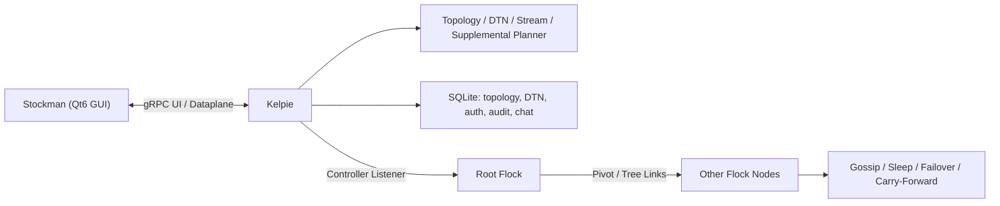

# Shepherd 答辩讲稿级架构说明与论文目录映射

本文是对 `docs/midterm_report.md` 的补充材料，目标不是替代正文，而是把现有代码、实验与论文材料整理成更适合答辩和写作的版本。

适用场景：

- 答辩前快速复述系统架构
- 整理论文章节与代码/实验材料的对应关系
- 作为 PPT、讲稿和论文正文之间的“索引页”

---

## 1. 一句话定位

Shepherd 是一个面向受限网络的延迟容忍远程运维原型系统，针对高时延、间歇连接、拓扑频繁变化等环境，把 `Gossip 拓扑维护`、`补链自愈`、`DTN store-carry-forward` 和 `可靠流式传输` 组合在一起，目标是在 duty-cycling 和多跳链路下仍保持控制面可收敛、消息可最终交付、握手过程可验证。

---

## 2. 答辩讲稿级架构说明

### 2.1 30 秒版本

如果老师只给很短时间，可以直接按下面这段讲：

> 我的毕业设计是一个面向受限网络的远程运维原型。传统持续在线、中心化的控制方式在高时延、间歇连接和多跳链路下很容易失效，所以我设计了一个三组件系统：Kelpie 作为管理端，Flock 作为代理节点，Stockman 作为桌面客户端。核心思路是用 Gossip 维护拓扑，用补链机制做自愈，用 DTN 队列保证离线期间消息不丢，再在 DTN 之上做可靠流传输。中期阶段我已经完成了代码实现、Trace 回放实验框架、两类关键实验，以及握手安全的形式化验证骨架。

### 2.2 3 分钟版本

如果需要一段更完整、适合系统架构页的讲稿，可以直接按下面的顺序讲：

> 我的课题要解决的问题，不是普通局域网里的远程控制，而是受限网络里的控制面稳定性问题。这里的“受限网络”包括高时延、链路频繁中断、节点会睡眠、拓扑会不断变化。  
>
> 因此，系统设计不能依赖“所有节点持续在线”这个前提。我的方案是把系统拆成三个角色：Kelpie 是管理端，负责维护拓扑、调度补链、管理 DTN 队列和 STREAM 引擎，并通过 gRPC 向 GUI 暴露统一控制面；Flock 是部署在网络中的代理节点，负责接入、gossip、转发、sleep/failover 和 carry-forward；Stockman 是 Qt 桌面客户端，负责观测和操作。  
>
> 从机制上看，这个系统有四个核心点。第一，Gossip 用来维护节点视图和拓扑快照，解决大规模和动态拓扑下的状态同步问题。第二，补链机制在父链路断开或者节点离线时创建冗余连接，提高自愈能力。第三，DTN 队列采用 store-carry-forward，在目标节点离线时先把消息保存在内存中，等目标重新接触后再投递，解决“断续连接下消息丢失”的问题。第四，我在 DTN 之上做了一个可靠流传输层 STREAM，通过窗口、ACK、RTO 和重传机制，让系统不只是发离散指令，还能做更稳定的数据通道。  
>
> 实现上，Kelpie 内部主要由 topology、supplemental planner、DTN manager、stream engine 和 gRPC server 组成；Flock 内部主要由 gossip、routing、sleep predictor、failover 和 carry queue 组成。两端通过统一协议通信，UI 再通过 proto 定义的 gRPC 服务访问 Kelpie。  
>
> 为了让毕业设计不是“只能演示、不能证明”，我额外做了两层支撑。一层是 Trace 回放实验框架，它能在本机快速拉起 mini-cluster，自动注入睡眠、DTN 入队、故障等事件，并导出 metrics.jsonl、CSV 和 SVG 图表。另一层是形式化验证骨架，我把握手流程抽象成 ProVerif 和 Tamarin 模型，用来支撑安全性论证。  
>
> 当前中期结果已经说明两件事：一是 Gossip 拓扑在不同节点规模和拓扑形状下可以收敛；二是 duty-cycling 场景下 DTN 可以保证最终交付，而且交付时延会随着 sleep 周期变大而上升。这说明我的方案不是纯工程堆砌，而是围绕“睡眠窗口 + 多跳 + 断续连接”这个核心矛盾做的系统化设计。

### 2.3 架构图讲法

答辩时可以配合下面这张逻辑图讲：

这张图建议这样解释：

1. Stockman 不直接连各个代理节点，而是只和 Kelpie 通信。
2. Kelpie 是系统状态中心，负责统一观测和统一控制。
3. Root Flock 是管理域进入受限网络的第一跳，后续节点通过 pivot/tree/supplemental 链路接入。
4. Flock 节点之间的行为不是“永远在线”，而是允许睡眠、故障、重连和带缓存转发。
5. SQLite 的作用不只是存配置，还承担了拓扑、DTN、审计和协作信息的持久化。

### 2.4 模块分工怎么讲

| 模块 | 主要代码落点 | 负责什么 | 答辩时建议表述 |
| --- | --- | --- | --- |
| Kelpie 入口 | `cmd/kelpie/main.go` | 启动 teamserver、加载 listener、初始化拓扑/数据库/gRPC | “它是管理端主进程，负责把系统从启动状态带到可观测、可控制状态。” |
| Kelpie 核心调度 | `internal/kelpie/process/` | 拓扑调度、补链、DTN、STREAM、listener/proxy 管理 | “它相当于系统的大脑，核心控制逻辑都集中在这里。” |
| 拓扑层 | `internal/kelpie/topology/` | 节点、边、路由、离线判定、快照 | “它负责回答两个问题：系统里现在有哪些节点，以及应该怎么走到目标节点。” |
| DTN 队列 | `internal/kelpie/dtn/` | 内存队列、TTL、优先级、hold-until、投递统计 | “它负责回答：目标不在线时，消息怎么暂存、什么时候再发。” |
| STREAM 引擎 | `internal/kelpie/stream/` | 分片、窗口、ACK、RTO、重传、诊断 | “它把离散消息提升为可靠的数据流。” |
| Flock 代理 | `internal/flock/process/` | 接入、gossip、relay、sleep、failover、carry-forward | “它是受限网络中的执行节点和中继节点。” |
| Gossip 子系统 | `internal/flock/gossip/` | 成员信息传播和视图同步 | “它保证管理端能逐步获得一个足够新鲜的网络视图。” |
| gRPC 控制面 | `proto/kelpieui/v1/kelpieui.proto`、`internal/kelpie/ui/grpcserver/` | UI 查询和管理 API | “它把内部能力以稳定接口暴露给客户端和实验器。” |
| 桌面客户端 | `clientui/` | GUI 展示、操作、对接 gRPC | “它不是业务核心，但负责把系统状态和控制能力可视化。” |

### 2.5 运行链路怎么讲

按“从启动到运行”的顺序讲最自然：

1. Kelpie 启动，初始化 SQLite、拓扑、gRPC 服务，并读取 controller listener。
2. 根节点 Flock 通过 controller listener 接入，形成管理域到受限网络的第一条链路。
3. 后续 Flock 通过 pivot listener 或树状链路继续加入，Kelpie 开始形成拓扑快照。
4. Flock 节点通过 Gossip 更新自己所见的邻居和状态，Kelpie 根据这些信息更新拓扑。
5. 如果某些父链路断开或者节点进入睡眠，Kelpie 的补链逻辑会尝试创建冗余链路。
6. 如果目标节点暂时不在线，消息先进入 DTN 队列，等下次接触窗口到来后再继续发送。
7. 对于持续的数据交换需求，Kelpie 在 DTN 之上再建立 STREAM，会话通过 ACK、窗口和重传机制维持可靠性。

### 2.6 创新点怎么讲

不要把创新点讲成“我做了很多模块”，而要讲成“我围绕一个矛盾做了协同设计”。

| 创新主张 | 要解决的矛盾 | 设计落点 | 现有证据 |
| --- | --- | --- | --- |
| Gossip 化拓扑维护 | 节点多、链路动态，集中维护成本高 | `internal/flock/gossip/` + `internal/kelpie/topology/` | bootstrap/convergence 实验 |
| 补链自愈 | 父链路离线导致整支子树失联 | `SupplementalPlanner`、listener/pivot 管理 | 失效恢复与后续消融计划 |
| DTN + sleep 协同 | 节点长时间离线导致控制消息丢失 | `internal/kelpie/dtn/`、`topology/latency.go`、sleep profile | duty-cycling 下交付时延实验 |
| DTN 上的可靠流 | 单条消息机制难以支撑更长数据流 | `internal/kelpie/stream/` | `stream_proxy`、`dataplane_*` trace |
| 握手安全可论证 | 工程握手难以直接说明安全性 | `pkg/share/preauth.go`、`pkg/share/handshake/`、`formal/` | ProVerif/Tamarin 骨架 |

---

## 3. 推荐论文目录与材料映射

下面给出一套适合当前项目状态的 8 章结构。它的原则是：先讲问题和总体架构，再按两条主机制线展开，最后落到实现、实验和总结。

| 章节 | 本章要回答的问题 | 主要代码/实现材料 | 实验/图表/补充材料 | 写作要点 |
| --- | --- | --- | --- | --- |
| 第 1 章 绪论 | 为什么要研究受限网络下的远程运维 | `README.md`、`docs/shepherd_paper.md` | `docs/midterm_report.md` 摘要与研究问题 | 先把“受限网络”讲清楚，再说明传统持续在线控制面的局限 |
| 第 2 章 场景分析与相关技术 | 这个问题涉及哪些技术方向，现有方法有什么不足 | `docs/shepherd_paper.md` 第 1~3 节 | 参考文献列表、`formal/README.md`、`experiments/README.md` | 把 Gossip、DTN、duty cycling、AKE/PSK 握手几条线串起来 |
| 第 3 章 系统总体架构设计 | Shepherd 整体由哪些角色和控制面组成 | `cmd/kelpie/`、`cmd/flock/`、`clientui/`、`proto/kelpieui/v1/kelpieui.proto`、`internal/kelpie/ui/grpcserver/` | 本文第 2 节架构讲稿、建议配总架构图 | 强调三组件与控制面/数据面/持久化三层关系 |
| 第 4 章 拓扑维护与补链自愈机制 | 系统如何在动态网络中收敛并恢复 | `internal/flock/gossip/`、`internal/kelpie/topology/`、`internal/kelpie/process/supplemental_planner.go`、listener/pivot 相关实现 | `docs/data/bootstrap_summary.csv`、`docs/figures/bootstrap_convergence.svg`、`experiments/trace_replay/traces/gossip_*` | 这是“拓扑与自愈”主线，重点讲收敛、离线判定、补链候选评分 |
| 第 5 章 DTN/STREAM 与 duty-cycling 协同机制 | 目标离线时如何最终交付，为什么时延会变化 | `internal/kelpie/dtn/`、`internal/kelpie/stream/`、`internal/kelpie/topology/latency.go`、`internal/flock/process/sleep*.go` | `docs/data/dtn_latency_samples.csv`、`docs/data/dtn_latency_summary.csv`、`docs/figures/dtn_latency.svg`、`experiments/trace_replay/traces/dtn_*` | 这是“可靠交付”主线，先讲 store-carry-forward，再讲 STREAM 和 sleep 协同 |
| 第 6 章 安全机制与协作控制面 | 握手为什么可信，UI/审计/协作面如何支撑系统使用 | `pkg/share/preauth.go`、`pkg/share/handshake/`、`formal/`、`internal/kelpie/collab/auth/`、`audit/`、`chat/` | `formal/README.md`、形式化模型文件、`docs/midterm_report.md` 第 7.5 节 | 不要只写“有登录”，要写“认证、审计、形式化论证”三层关系 |
| 第 7 章 系统实现与工程化落地 | 这个系统具体是怎样构建、部署、存储和运行的 | `Makefile`、`internal/kelpie/storage/sqlite/`、`cmd/lab/bootstrap/`、`docker/`、`clientui/` | `docker/README_运行环境.md`、`experiments/trace_replay/README.md` | 这一章回答“系统真的能跑起来，而且能复现” |
| 第 8 章 实验设计与结果分析 | 方案到底是否有效，当前证据能说明什么 | `script/run_experiments_local.sh`、`experiments/analysis/`、`experiments/trace_replay/` | `docs/experiment_report.md`、`docs/midterm_report.md` 第 4 节、`docs/data/*.csv`、`docs/figures/*.svg` | 按“实验目标-场景-指标-结果-分析-威胁”写，保持统计口径一致 |
| 第 9 章 总结与展望 | 当前完成了什么，还缺什么 | `docs/midterm_report.md` 第 6、7 节 | 里程碑 M1~M4、后续 Mininet/ns-3/形式化细化计划 | 总结时不要只写“已完成”，要明确后续补强路线 |

---

## 4. 每章可以直接调用的材料清单

### 4.1 适合直接放论文图表的材料

- 拓扑收敛图：`docs/figures/bootstrap_convergence.svg`
- DTN 时延图：`docs/figures/dtn_latency.svg`
- 拓扑收敛统计：`docs/data/bootstrap_summary.csv`
- DTN 逐条样本：`docs/data/dtn_latency_samples.csv`
- DTN 按 run 汇总：`docs/data/dtn_latency_summary.csv`

### 4.2 适合直接放论文“实现章节”的材料

- Kelpie 启动与 teamserver 模式：`cmd/kelpie/main.go`
- Flock 接入模式：`cmd/flock/main.go`
- UI gRPC 服务集合：`proto/kelpieui/v1/kelpieui.proto`
- Dataplane 管理接口：`proto/dataplane/v1/dataplane.proto`
- Trace 回放实验器：`experiments/trace_replay/`
- SQLite 持久化模式：`internal/kelpie/storage/sqlite/`

### 4.3 适合直接放论文“安全章节”的材料

- 预认证挑战应答：`pkg/share/preauth.go`
- 握手状态与记录：`pkg/share/handshake/`
- ProVerif 模型：`formal/proverif/shepherd_handshake.pv`
- Tamarin 模型：`formal/tamarin/shepherd_handshake.spthy`

---

## 5. 当前材料充足度评估

如果从“现在开始写论文”的角度判断，材料充足度大致如下：

| 章节 | 当前材料强度 | 原因 |
| --- | --- | --- |
| 绪论/问题背景 | 强 | README、开题报告、中期报告都已成形 |
| 总体架构 | 强 | 三组件结构明确，代码入口清晰 |
| 拓扑与补链 | 中等偏强 | 代码较完整，但补链消融数据还不足 |
| DTN/STREAM | 强 | 代码实现、trace、图表、分析口径都比较完整 |
| 安全与形式化 | 中等 | 已有骨架和代码映射，但证明深度仍需补齐 |
| 系统实现 | 强 | 构建、部署、数据库、GUI、实验器都已具备 |
| 实验分析 | 中等偏强 | 已有两组关键实验，但重复次数和对照规模还可以加强 |
| 总结与展望 | 强 | 中期报告已经列出后半程路线 |

当前最容易写扎实的章节是：

1. 系统总体架构
2. DTN/STREAM 与 duty-cycling 协同
3. 系统实现与工程化
4. 中期实验结果分析

当前最需要继续补强的章节是：

1. 补链策略的消融实验
2. Gossip 自适应参数的对照实验
3. Mininet 或更真实链路条件下的外部验证
4. 形式化模型的并发/重放细化

---

## 6. 建议的答辩页序

如果你要把这份文档继续转成 PPT，建议按下面的 8 页最小结构做：

1. 研究背景与问题定义
2. 系统目标与总体思路
3. 三组件总体架构图
4. 拓扑维护与补链自愈机制
5. DTN/STREAM 与 duty-cycling 协同机制
6. 系统实现与控制面接口
7. 实验设计与关键结果
8. 当前结论、局限与后续计划

这样安排的好处是：前 3 页先让老师理解“你在解决什么问题、系统长什么样”，中间 3 页讲机制和实现，最后 2 页用实验和计划收口，逻辑比较稳。

---

## 7. 使用建议

如果你接下来要继续完善论文，建议按这个顺序推进：

1. 先把第 3、5、7、8 章写出来，因为这些章节材料最完整。
2. 再补第 4 章的补链/Gossip 消融，把“架构设计”提升到“有对照证据”。
3. 最后收敛第 6 章，把安全与形式化从“骨架可运行”写成“性质可解释、与实现有映射”。

如果你接下来要准备中期或终期答辩，建议直接把第 2 节和第 6 节转成讲稿和 PPT 大纲使用。
