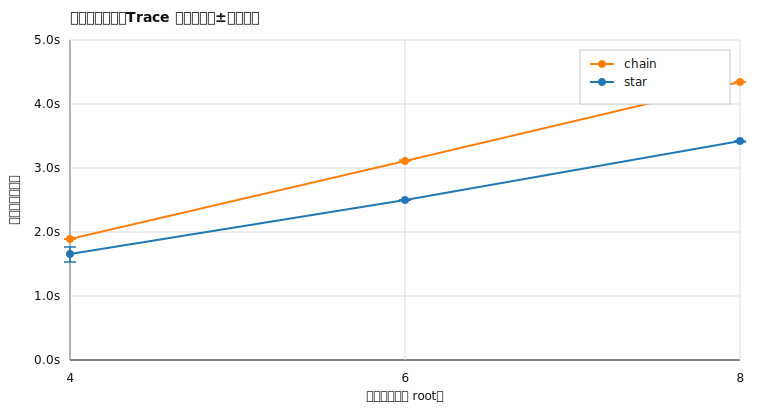
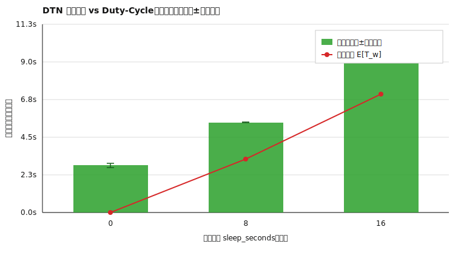

# Shepherd：面向受限网络的 Gossip 化延迟容忍远程运维系统
## 中期进展与实验阶段报告（中期答辩稿）

（作者：`<姓名>`；学号：`<学号>`；学院：`<学院>`；专业：`<专业>`；指导教师：`<教师姓名>`）  
日期：2026-02-15

---

## 摘要

受限网络（高时延、间歇连接、拓扑频繁变化）使传统“持续在线、中心化控制”的远程运维架构难以稳定工作。为此，本课题以 Shepherd 原型系统为载体，探索 **Gossip 拓扑维护 + 补链自愈 + 延迟容忍网络（DTN）队列 + 多路复用流（STREAM）** 的一体化设计，目标是在 duty-cycling（周期睡眠）与多跳链路环境下仍可实现稳定的控制面收敛与可靠消息交付，并形成可复现实验数据与形式化安全论证材料。

中期阶段完成了：三组件工程化构建（Kelpie/Flock/Stockman）、Trace 回放式可复现实验框架与分析脚本、两类关键实验（拓扑收敛与 duty-cycling 下 DTN 交付时延）、以及握手流程形式化验证骨架（Tamarin/ProVerif + Docker 复现）。同时修复了数个阻塞实验复现的关键缺陷（离线节点误删除、监听一次性退出、失败接管的无谓等待、DTN carry-forward 回放窗口错过等），使“睡眠场景下 DTN 交付成功率”达到稳定复现。

**关键词**：受限网络；Gossip；DTN；Duty Cycling；可复现实验；形式化验证

---

## 1 课题目标与研究问题

本课题的核心目标是构建一个面向受限网络的远程运维原型，并回答以下研究问题：

1. 在节点数量增长、拓扑多跳与链路抖动条件下，Gossip 维护的拓扑能否在可接受时间内收敛（bootstrap/convergence）？
2. 在 duty-cycling（周期睡眠）导致目标节点长期离线的情况下，DTN 的 store-carry-forward 机制能否保证消息最终交付？交付时延与 duty-cycle 参数之间是否存在可解释的关系？
3. 系统的握手认证流程能否给出可复现、可审计的安全性论证材料（形式化模型骨架）？

开题阶段的研究设想、模型与计划见 `docs/paper.md`。

---

## 2 系统设计与实现概述

### 2.1 三组件架构

- **Kelpie（管理端/服务端）**：维护拓扑图、DTN 队列、STREAM 引擎，并向 GUI 暴露 gRPC API（见 `cmd/kelpie`、`internal/kelpie/`）。
- **Flock（代理端）**：在受限网络中执行 gossip、路由与 relay，处理 DTN/STREAM 消息与睡眠/唤醒循环（见 `cmd/flock`、`internal/flock/`）。
- **Stockman（GUI 客户端）**：Qt6 桌面客户端，通过 gRPC 与 Kelpie 交互（见 `clientui/`）。

### 2.2 关键机制

1. **Gossip 拓扑维护**：通过 push-pull 交换成员信息与链路质量，Kelpie 侧维护可查询的拓扑快照。
2. **补链自愈（Supplemental Links）**：当节点离线或父链路不稳定时，系统可创建冗余连接以提升连通性与恢复速度。
3. **DTN（store-carry-forward）队列**：在链路中断时将消息暂存于内存队列，待接触恢复后继续转发；以 ACK 统计“已交付”进度。
4. **Duty Cycling 支持**：节点周期睡眠导致的“离线”需要与拓扑判定协同，否则容易出现误删或误判。

---

## 3 中期阶段完成情况评估

为满足“可复现 + 可评估”的毕业设计要求，中期阶段优先完成了实验链路与可观测性建设。

### 3.1 已完成（可复现）

- **可复现实验框架（Trace 回放）**：`experiments/trace_replay/` 支持在本机启动 mini-cluster，注入睡眠/DTN 入队/故障等事件，并导出 `metrics.jsonl`。
- **实验分析与出图**：`experiments/analysis/` 将 `metrics.jsonl` 转为 CSV，并生成 SVG 图表。
- **一键实验脚本**：`script/experiments.sh` 端到端生成 `docs/data/*.csv` 与 `docs/figures/*.svg`，用于中期/论文写作的“可复现产物”管理。
- **形式化验证骨架**：`formal/` 提供握手流程的 ProVerif/Tamarin 模型与 Docker 复现说明（中期阶段以“骨架可跑通”为目标）。

### 3.2 进行中/待补齐

- **更大规模与更真实网络条件的评估**：目前以本机 Trace 回放为主，Mininet/ns-3 已提供骨架但尚未形成系统性对照数据（见 `experiments/mininet/`、`experiments/ns3/`）。
- **形式化模型的覆盖面扩展**：当前模型用于证明“认证/密钥保密”等基本性质，仍需逐步补充重放、防字典攻击、错误处理分支等细节。
- **GUI 与运维侧可观测性增强**：例如事件审计、异常重连的自动恢复策略、跨流公平等，需要在后续阶段补齐。

---

## 4 可复现实验设计与阶段性结果

本节给出中期阶段两组实验：**拓扑收敛**与 **duty-cycling 下 DTN 交付时延**。所有结果均可通过 `bash script/experiments.sh` 在本机复现，并生成 CSV 与 SVG 图表作为论文插图来源。

### 4.1 实验 A：拓扑 bootstrap/收敛时间

**目的**：评估 Gossip 拓扑在不同拓扑形状与节点规模下的收敛速度。

**场景设置**（由脚本自动执行）：

- 拓扑：`star`（星型）、`chain`（链式多跳）
- 节点数：4、6、8（包含 root）
- 每组重复：3 次
- 运行时长：20s
- 指标采样：500ms

**指标定义**（来自 `docs/data/bootstrap_summary.csv`）：

- `bootstrapped_ms`：标记“bootstrap 完成”的时间点（ms）
- `converged_ms`：拓扑快照满足“节点数正确、全部 online、边数达到阈值”的最早时间点（ms）

**结果**（收敛时间统计，单位：秒）：

| 拓扑 | 节点数 | 收敛时间均值 ± 标准差 | 最小-最大 |
| --- | --- | --- | --- |
| star  | 4 | 1.661 ± 0.116 | 1.593–1.795 |
| star  | 6 | 2.517 ± 0.003 | 2.514–2.520 |
| star  | 8 | 3.438 ± 0.005 | 3.433–3.441 |
| chain | 4 | 1.905 ± 0.004 | 1.901–1.908 |
| chain | 6 | 3.138 ± 0.002 | 3.136–3.139 |
| chain | 8 | 4.372 ± 0.006 | 4.368–4.378 |

图 1 给出了均值±标准差的趋势图（由脚本生成）：

**分析**：在相同节点数下，`star` 通常快于 `chain`，原因是星型拓扑下节点与 root 的直接接触更频繁；链式拓扑需要多跳建立与中继稳定后才达到“全 online + 边数满足条件”的收敛判据。随着节点数增加，两种拓扑的收敛时间均呈上升趋势。

### 4.2 实验 B：duty-cycling 对 DTN 交付时延的影响

**目的**：验证 store-carry-forward 在目标节点周期睡眠情况下的交付可靠性，并评估交付时延随 duty-cycle 参数变化的趋势。

**场景设置**：

- 固定拓扑：链式 `chain`，节点数 4（root → n1 → n2 → n3）
- 目标节点：`n3`
- 消息入队：在 12s/20s/28s 各入队 1 条（共 3 条）
- 重复：每种 trace 2 次
- 运行时长：70s
- duty-cycle：baseline（无睡眠）、sleep8/work2、sleep16/work2（睡眠发生在目标节点 n3）

**理论模型**：开题报告中采用 duty-cycling 的“期望等待时间”模型
\[
E[T_w] = \frac{T_{sleep}^2}{2(T_{sleep}+T_{work})}.
\]
当 `sleep8/work2` 时，\(E[T_w]=3.2\)s；当 `sleep16/work2` 时，\(E[T_w]\approx 7.11\)s。

**指标定义**：

- 交付时延：`latency_ms = deliver_ms - enqueue_ms`（逐条样本，见 `docs/data/dtn_latency_samples.csv`）
- 交付成功：以 metrics 快照中 `dtn_metrics.delivered` 增量计数作为“已交付”事件（采样周期 500ms）

**结果**（逐条样本聚合，单位：秒；每组样本数 n=6，即 2 次重复 × 3 条消息）：

| 场景（sleep/work） | 理论 E[T_w] | 测量均值 ± 标准差 | 中位数（p50） | 最小-最大 | 交付数 |
| --- | --- | --- | --- | --- | --- |
| 0/0 | 0.000 | 2.825 ± 1.251 | 2.491 | 1.394–4.589 | 6/6 |
| 8/2 | 3.200 | 5.401 ± 1.633 | 5.402 | 3.401–7.402 | 6/6 |
| 16/2 | 7.111 | 9.400 ± 4.320 | 11.401 | 3.400–13.400 | 6/6 |

图 2 展示了“测量均值±标准差”与“理论期望线”的对比：

**分析**：随着 `T_sleep` 增大，交付时延整体上升，且方差显著增大（sleep16/work2 呈现更强的离散性）。测量均值通常大于理论 \(E[T_w]\)，主要来源包括：多跳转发的排队与重传开销、指标采样的量化误差（500ms granularity）、以及睡眠相位与入队时间对齐造成的“窗口错过”效应。图 2 的误差棒统计口径为“按 run 汇总的 mean_ms”的标准差，消息级的离散程度可结合表中 min/max 与 `docs/data/dtn_latency_samples.csv` 进一步分析。尽管存在抖动，DTN 机制在该场景下实现了 100% 的最终交付（6/6）。

---

## 5 阻塞复现的关键缺陷定位与修复（中期阶段）

为保证实验可复现，中期阶段对影响“睡眠/离线场景”稳定性的缺陷进行了集中修复。归纳如下（以现象→原因→修复思路的方式表述）：

1. **现象**：节点短暂离线后在 Kelpie 拓扑中“消失”，导致子树被误删，后续无法复连。  
原因：离线事件被错误处理为“删除节点/子树”。  
修复：引入“标记离线”的拓扑任务，离线节点保留结构但状态变更为 offline，从而允许后续重连恢复。

2. **现象**：Flock 监听端只 accept 一次就退出，导致重连失败。  
原因：监听循环使用 `return` 退出。  
修复：将一次性退出改为继续 accept，使监听长期有效。

3. **现象**：failover（父节点接管）路径上出现不必要的固定等待，压缩了短唤醒窗口，造成“看似在线但无法及时转发”。  
原因：无 pending 的情况下仍进入等待分支。  
修复：仅在存在待处理 failover 时等待，否则立即返回并继续正常重连。

4. **现象**：在短唤醒场景（例如 sleep16/work2）下，DTN 消息入队后长期不交付，最终出现“入队 3 条只交付 1 条”的复现。  
原因：carry-forward 队列的 backoff 与 hold-until 触发条件叠加，错过了关键唤醒窗口。  
修复：当子连接（或补链连接）就绪时触发一次“强制 flush”，优先清空 carry 队列，避免被 hold-until 阻塞。

上述修复使得 `script/experiments.sh` 所覆盖的中期实验场景能够稳定复跑并得到一致结论（见第 4 节）。

---

## 6 后半程执行计划（里程碑）

为确保最终论文达到“高质量可答辩”标准，后半程按 4 个里程碑推进（以 **2026-02-15** 为当前基线）：

| 里程碑 | 时间窗口 | 核心目标 | 验收产物 |
| --- | --- | --- | --- |
| M1 | 2026-02-16 ~ 2026-03-07 | 完成“基线/消融”最小闭环（本机 Trace） | `docs/data/*_ablation.csv`，补充图表与统计口径说明 |
| M2 | 2026-03-08 ~ 2026-03-28 | 引入 Mininet 受控链路（delay/loss/jitter）并形成对照 | Mininet 场景脚本 + 对照图（本机 vs Mininet） |
| M3 | 2026-03-29 ~ 2026-04-18 | 形式化模型从“骨架”扩展到并发/重放分支 | `formal/` 新模型与证明日志，代码映射表更新 |
| M4 | 2026-04-19 ~ 2026-05-10 | 论文整合与答辩材料定稿 | 论文初稿、实验附录、答辩 PPT 与演示脚本 |

---

## 7 对照硬指标的中期达成评估（答辩核心）

### 7.1 硬指标 1：创新点是否清晰且“可落到代码”

| 创新主张 | 关键机制 | 代码落点（函数级） | 阶段性证据 |
| --- | --- | --- | --- |
| C1：Duty-cycling 感知的路由与 DTN 协同 | 发送时机与 ACK 超时显式考虑睡眠预算，节点重在线时立即释放 hold | `internal/kelpie/topology/latency.go` 的 `dutyCycleWaitSeconds()`、`RecommendSendDelay()`；`internal/kelpie/process/dtn.go` 的 `dtnAckTimeout()`、`onNodeReonline()`；`internal/kelpie/topology/nodes.go` 的 `markNodeOffline()`/`markStaleOffline()` | 实验 B 中 `sleep8/work2` 与 `sleep16/work2` 的时延单调上升且仍保持 6/6 交付 |
| C2：面向离线波动的补链自愈调度器 | 候选评分（质量/睡眠/重叠/深度/冗余/工作窗）+ 失败重试/repair + duty-cycle 感知离线探测 | `internal/kelpie/planner/metrics.go` 的 `candidateScore()`、`nodeQualityScore()`、`adjustQualityWeights()`；`internal/kelpie/planner/planner.go` 的 `tryRepair()`、`performRepair()`；`internal/kelpie/planner/events.go` 的 `offlineProbeDelay()`、`offlineProbeThreshold()` | 关键缺陷修复后，睡眠场景下补链与 DTN 不再出现长期“窗口错过” |
| C3：在 DTN 承载下的可靠流式传输 | 自适应 RTO（SRTT/RTTVAR）+ AIMD 窗口控制 + 乱序缓存重组 + 会话诊断 | `internal/kelpie/stream/engine.go` 的 `observeRTTLocked()`、`adjustWindowOnAckLocked()`、`reduceWindowOnLossLocked()`、`HandleData()`、`Diagnostics()`；`internal/kelpie/process/stream.go` 的 `initStreamEngine()` DTN 友好参数 | 已具备 `stream_proxy` 与 `dataplane_*` trace，可用于后续系统级 IO 评估 |

结论：当前创新点不是“模块拼接”，而是围绕“睡眠窗口+多跳+断续连接”这一核心矛盾做协同设计，且每个主张都能落到实现函数与可复现实验。

### 7.2 硬指标 2：基线与消融是否“可执行”

| 编号 | 对照问题 | 自变量 | 指标 | 实现路径 | 状态 |
| --- | --- | --- | --- | --- | --- |
| B0 | 无睡眠时的 DTN 基线 | `sleep/work=0/0` | 交付率、时延均值/方差 | `dtn_sleep_effect_baseline.jsonl` | 已完成 |
| A1 | 睡眠强度对交付时延影响 | `sleep/work=8/2,16/2` | 同 B0 + 与理论 \(E[T_w]\) 偏差 | `dtn_sleep_effect_sleep8_work2.jsonl`、`dtn_sleep_effect_sleep16_work2.jsonl` | 已完成 |
| A4 | 补链策略贡献度 | 是否启用自动补链/repair | 重连成功率、恢复时延 | `SupplementalPlanner.SetEnabled()` 暴露到实验入口 | 待补齐（M1） |
| A5 | Gossip 自适应策略贡献度 | 动态 fanout/TTL vs 固定值 | 收敛时间、带宽放大、稳定性 | `dynamicFanout()`/`dynamicTTL()` 增加实验开关 | 待补齐（M1） |

结论：中期已完成 B0/A1 的“可复现对照”；A4/A5 需要在后半程补实验开关后形成完整消融矩阵。

### 7.3 硬指标 3：规模与真实性是否有清晰升级路线

| 阶段 | 目标规模/真实性 | 现状 | 下一步 |
| --- | --- | --- | --- |
| S0（本机回放） | 4~8 节点的稳定复现 | 已完成（第 4 节） | 增加重复次数与统计检验 |
| S1（本机压力） | 10~16 节点 + 故障/重启/IO 混合场景 | Trace 已具备（如 `gossip_memo_scale_n16.jsonl`、`topology_flap_kelpie_restart_n14.jsonl`） | 形成统一汇总表与瓶颈分析 |
| S2（Mininet） | 可控 delay/loss/jitter 的网络真实性 | `experiments/mininet/` 已有骨架 | 产出“本机 vs Mininet”对照图与差异解释 |
| S3（ns-3） | 论文友好的大规模可重复模拟 | `experiments/ns3/` 为路线骨架 | 二选一落地：TapBridge 真二进制或算法级模拟 |

结论：当前瓶颈不是“没有路线”，而是“尚未完成 S2/S3 的数据闭环”；该项是后半程能否冲击高质量论文的关键。

### 7.4 硬指标 4：统计方法是否可审计

当前中期结果已给出均值/标准差与样本范围，但重复次数偏少（收敛实验 3 次、DTN 实验 2 次）。后半程按以下口径升级：

1. **重复次数**：关键场景提升到每组 `n>=20`（收敛）与 `n>=30`（时延样本，按消息计）。
2. **区间估计**：报告 95% 置信区间（优先 bootstrap 重采样，重采样次数建议 10,000）。
3. **显著性检验**：时延分布优先采用 Mann-Whitney U（或 Kruskal-Wallis + 事后检验），避免仅凭均值判断。
4. **效应量**：补充 Cliff's delta（或相近非参数效应量），避免“显著但效应很小”的误判。
5. **多重比较控制**：当消融组合增加时采用 Holm-Bonferroni 控制一类错误。
6. **误差来源披露**：明确采样粒度（当前 500ms）、系统调度抖动、trace 相位对齐偏差，并给出误差上界。

### 7.5 硬指标 5：形式化模型与实现是否形成闭环映射

| 形式化元素 | 代码实现映射 | 当前状态 | 待补齐 |
| --- | --- | --- | --- |
| 预认证 `Nonce + MAC` 挑战应答 | `pkg/share/preauth.go`：`ActivePreAuth()` / `PassivePreAuth()` | 已对齐 | 将失败分支与超时分支映射到可验证事件 |
| 握手阶段事件（start/dial/tls/negotiate/preauth/mfa/exchange/complete） | `pkg/share/handshake/handshake.go` 的 `Transcript` 与 `Code*`；`internal/flock/initial/method.go` 记录并 `Annotate` 错误 | 已对齐 | 在服务端同样补充结构化事件并统一导出 |
| HI/UUID 交换对应性 | `handshake.NewHIMess()` + `achieveUUID()`（agent 初始流程） | 已对齐（骨架级） | 增加会话绑定与抗重放细化 |
| 秘钥与口令约束 | `ValidateSecretComplexity()`、`ValidateMFAPin()`、`SessionSecret()` | 已实现 | 将复杂度与策略约束纳入形式化假设说明 |
| 形式化性质 | `formal/proverif/handshake.pv`、`formal/tamarin/handshake.spthy` | 中期为“骨架可跑通” | 扩展并发会话、注入一致性、重放场景 |

结论：形式化与代码已建立“骨架级一一对应”，但要达到论文强结论，必须在 M3 完成并发与重放分支的精化证明。

### 7.6 面向“高质量论文”的中期结论

仅从工程完成度与可复现性看，本课题已经具备冲击高质量论文的基础；但能否最终达到目标，取决于后半程是否完成三件事：

1. 把 A4/A5（补链与 gossip 的核心消融）补成数据闭环；
2. 把 S2（Mininet 受控网络）做成对照，不再仅依赖本机回放；
3. 把统计与形式化从“骨架可运行”升级为“结论可审计”。

---

## 8 参考文献

本中期报告的理论背景与主要参考文献沿用开题报告 `docs/paper.md`，中期阶段新增的实验数据与图表均可由 `script/experiments.sh` 复现生成。

---

## 附录：答辩补充材料入口

为避免中期报告正文继续膨胀，答辩讲稿级的系统架构说明，以及“论文目录 - 代码/实验材料”映射，已单独整理在：

- `docs/architecture.md`

建议配合本报告的第 2 节（系统设计与实现概述）、第 4 节（实验结果）和第 7 节（答辩核心）一起使用。该补充文档更偏“怎么讲、怎么写、材料放在哪”，适合直接拿去整理 PPT、讲稿和论文目录。
