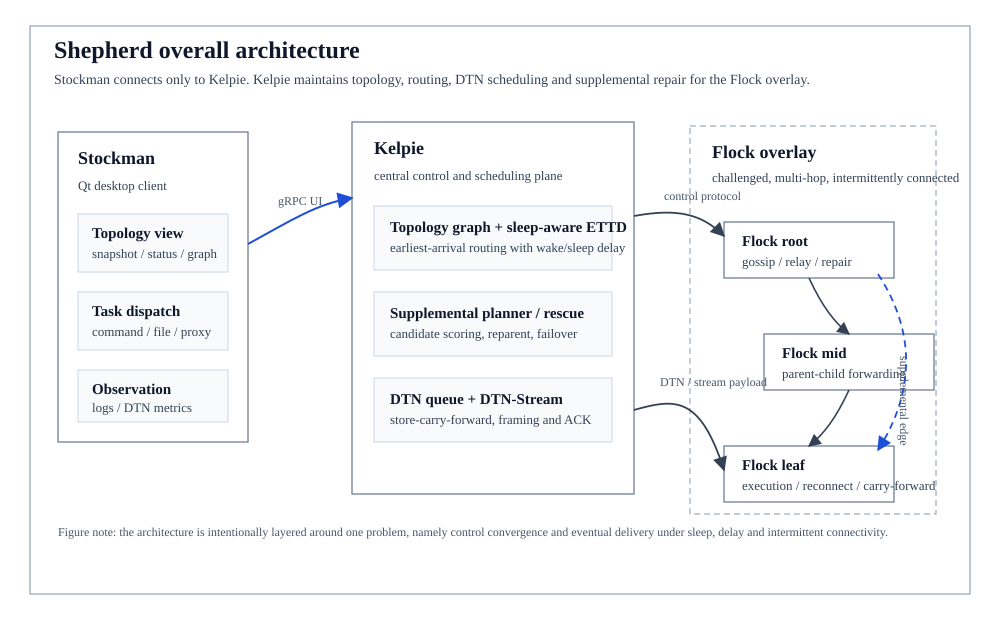
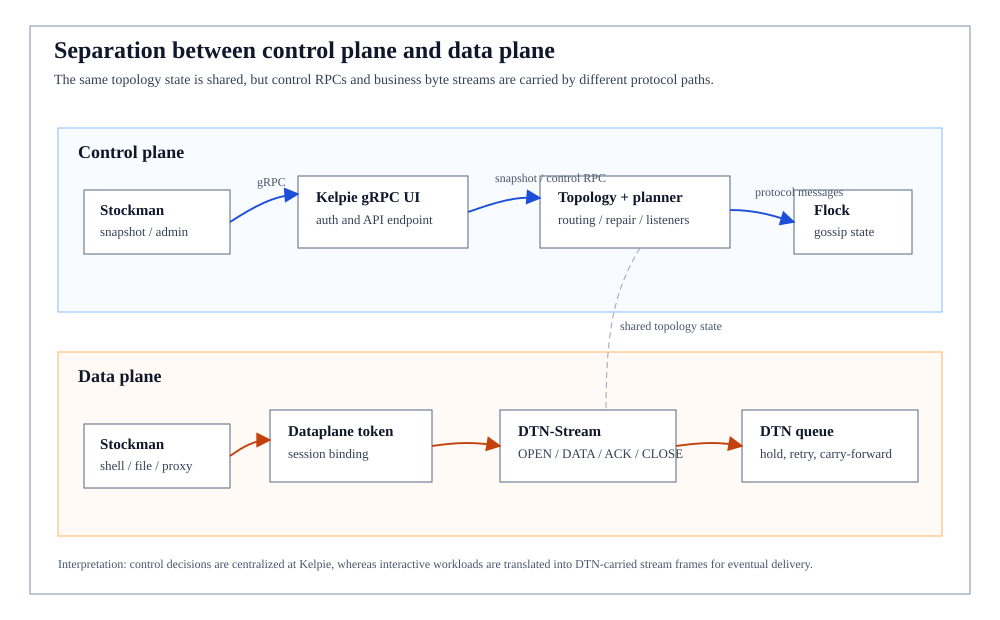
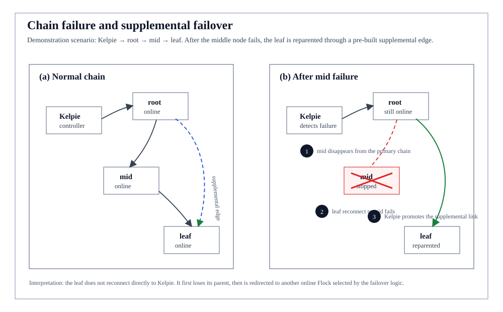
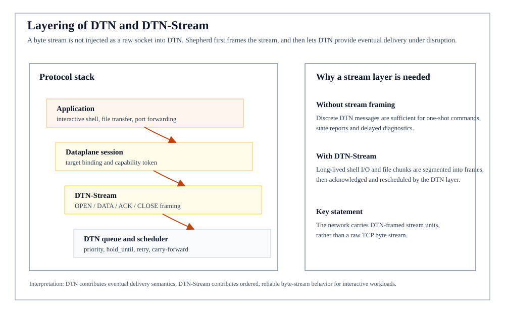
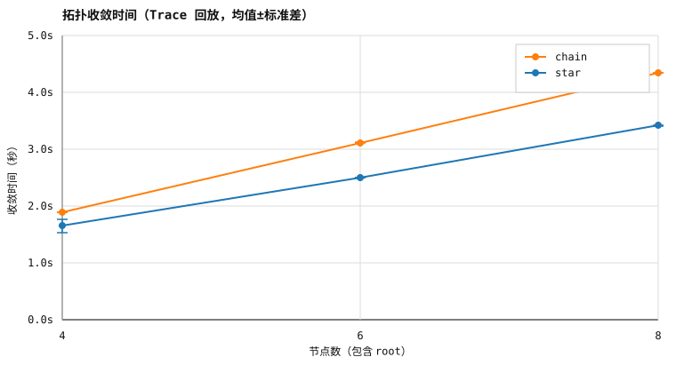
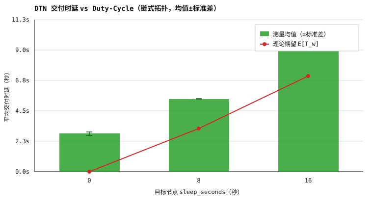

# Shepherd：面向受限网络的 Gossip 化延迟容忍远程运维系统设计与实现

> 本科毕业设计论文
> 学生：`<姓名>`  
> 学号：`<学号>`  
> 学院：`<学院>`  
> 专业：`<专业>`  
> 指导教师：`<教师姓名>`  
> 日期：2026 年 5 月

---

## 摘要

受限网络下的远程运维存在一个基本矛盾：管理端无法假设节点持续在线。野外应急组网、低功耗物联网与隔离运维等环境中，节点会周期性进入睡眠窗口，父链路可能随时中断，多跳拓扑也会不断重构。传统集中式远程运维依赖持续在线的会话、即时请求应答与稳定路由，一旦遇到上述波动，控制面便会出现视图陈旧、整支子树失联、消息丢失与长流中断。单纯的超时重试不足以应对这类场景：若目标已离线数分钟，增加重试次数并不会带来成功；若父链路断开，整支子树的可达性也不会仅凭重试恢复。

针对上述问题，本文设计并实现了原型系统 Shepherd，由管理端 Kelpie、代理端 Flock 与桌面客户端 Stockman 三部分组成。Kelpie 维护全局拓扑、调度补链自愈、管理 Delay-Tolerant Networking（DTN）队列、承载基于 DTN 的可靠流 STREAM，并通过 gRPC 向客户端暴露控制面。Flock 运行在受限网络节点上，负责接入、转发、Gossip 传播、sleep 状态上报与本地 carry-forward。Stockman 基于 Wails v3 与 Vue 3 重写，作为桌面演示客户端聚焦连接管理、拓扑总览、节点详情、事件时间线与演示控制台五个面板。

本文的设计思路是在同一个 sleep-aware 框架下协同组织四类机制，而非孤立地叠加已有协议。Gossip 层采用基于 $\log n$ 的自适应 fanout 与 TTL 在节点间逐步同步视图，其 payload 携带 sleep/work/next\_wake 字段，使 Kelpie 能够做出时间敏感的路由决策。补链调度器对候选节点按节点质量、路径重叠、睡眠预算、深度与冗余度进行评分，以防止补链演变为随机重连或过度 mesh。DTN 管理器按目标节点维护优先级队列，将 HoldUntil、ACK 超时与路径睡眠预算绑定，避免短时睡眠被误判为永久离线。STREAM 层在 DTN 载荷之上实现分片、累计 ACK、SRTT/RTTVAR 估计与 AIMD 窗口，使长数据流亦可继承 DTN 的重试语义。

系统评估基于一套可复现的 Trace 回放框架。拓扑收敛实验在 4、6、8 节点的 star 与 chain 拓扑下运行，chain 因多跳结构比 star 慢约 0.2--1.0 秒，并随节点数近似线性增长。duty-cycling 实验在 chain 拓扑下令目标节点周期睡眠，baseline、sleep8/work2 与 sleep16/work2 三组均实现 6/6 最终交付；扣除 baseline 观测到的约 2.3 秒多跳开销后，后两组实测时延与 $E[T_w]=T_s^2/\bigl(2(T_s+T_w)\bigr)$ 理论模型之间的偏差均不超过 0.2 秒。17 节点 star/chain 的补充回归进一步表明，连续 DTN memo bundle 在更大规模下仍能最终交付。在安全层面，本文给出基于预共享秘密、Nonce 与 HMAC 的预认证挑战应答协议，并配套 Tamarin/ProVerif 形式化验证骨架，覆盖 PSK 保密性与基本对应性。

本文亦明确讨论了当前原型的局限：论文图表实验以本机 Trace 回放为主，尚未引入 Mininet 或 ns-3 的真实链路扰动；重复次数偏少，尚未给出严格显著性检验；形式化模型仅覆盖 PSK 保密性与基本对应性，未涉及并发会话与重放；补链与 Gossip 的参数消融目前也仅覆盖核心路径。总体而言，本文的贡献不在于提出某个全新单点算法，而在于围绕受限网络远程运维控制面这一综合问题，完成了一次系统性拆解、工程实现与实验验证，并为后续的更大规模评估与形式化细化留出了明确接口。

**关键词**：受限网络；Gossip；延迟容忍网络；DTN；Duty Cycling；补链自愈；远程运维

---

## Abstract

Remote administration over challenged networks faces a fundamental tension: the controller cannot assume that every node stays continuously online. Nodes in field emergency deployments, low-power IoT systems, and isolated maintenance environments periodically enter sleep windows, upstream links fail without notice, and multi-hop topologies reshape themselves. Conventional centralised remote-administration systems are built on always-on sessions, immediate request--response exchanges, and stable routes. Once any of these assumptions breaks, the control plane exhibits stale views, whole subtrees become unreachable, messages are dropped, and long-lived streams are interrupted. Naive timeout-based retries do not address the underlying problem: if the target has been offline for several minutes, more retries will not succeed; and if the parent link fails outright, an entire subtree does not recover through retries alone.

This thesis designs and implements Shepherd, a prototype system that addresses this problem. Shepherd comprises three components: the controller Kelpie, the agent Flock, and the desktop client Stockman. Kelpie maintains the global topology, schedules supplemental self-healing links, manages Delay-Tolerant Networking (DTN) queues, carries a reliable STREAM transport on top of DTN, and exposes a gRPC control plane. Flock runs on network nodes and handles connection establishment, multi-hop relay, gossip propagation, sleep reporting, and local carry-forward. Stockman is rewritten in Wails v3 and Vue 3 as a desktop demonstration client, focusing on five panels: connection management, topology overview, node detail, event timeline, and a demonstration console.

The central design choice is to co-design four mechanisms under a single sleep-aware framework rather than stacking independent protocols. The gossip layer uses $\log n$-based adaptive fanout and TTL to converge node views, and piggybacks sleep, work, and next-wake hints so that Kelpie can make time-aware routing decisions. The supplemental planner scores candidate nodes by quality, path overlap, sleep budget, depth, and redundancy, preventing the supplemental layer from degenerating into random reconnects or excessive meshing. The DTN manager maintains per-target priority queues and binds HoldUntil, ACK timeout, and path sleep budget together so that a brief sleep window is not misinterpreted as a permanent outage. The STREAM layer implements fragmentation, cumulative ACKs, SRTT/RTTVAR estimation, and an AIMD congestion window over DTN payloads, allowing long flows to inherit the retry semantics of DTN.

Evaluation is based on a reproducible trace-replay framework. In 4-, 6-, and 8-node star and chain topologies, chain topologies converge roughly 0.2--1.0 seconds slower than star topologies, scaling approximately linearly with node count. In a chain topology with a duty-cycled target, the baseline, sleep8/work2, and sleep16/work2 groups all achieve 6/6 eventual delivery; after subtracting the approximately 2.3-second multi-hop baseline observed in the baseline group, the measured latencies in the two sleep groups deviate from the theoretical waiting-time model $E[T_w] = T_s^2 / \bigl(2(T_s+T_w)\bigr)$ by no more than 0.2 seconds. A supplementary 17-node star/chain regression further confirms that consecutive DTN memo bundles still reach their target at larger scale. On the security side, the thesis presents a pre-authentication challenge-response protocol based on a pre-shared secret, nonces, and HMAC, accompanied by a Tamarin/ProVerif verification skeleton that covers PSK secrecy and a basic correspondence property.

The thesis explicitly states the current limitations: the figure-producing experiments rely on local trace replay and do not yet use Mininet or ns-3 with realistic link perturbation; the number of repetitions is small and no rigorous significance tests have been performed; the formal model only covers PSK secrecy and basic correspondence, without concurrent sessions or replay; and the supplemental and gossip parameter ablations only cover the core configurations. The contribution of this work is therefore not a novel single-point algorithm, but a complete systems-level decomposition, engineering implementation, and experimental validation of the remote-administration control plane problem in challenged networks, with clearly scoped extension points for larger-scale evaluation and formal refinement.

**Keywords**: Challenged Networks; Gossip; Delay-Tolerant Networking; DTN; Duty Cycling; Self-Healing Links; Remote Administration

---

## 目录

1. 绪论  
2. 相关技术与研究现状  
3. 需求分析与总体架构  
4. Gossip 拓扑维护与补链自愈设计  
5. DTN/STREAM 与 Duty-Cycling 协同机制  
6. 系统实现  
7. 实验设计与结果分析  
8. 安全机制与形式化验证  
9. 局限性与改进方向  
10. 总结  

---

## 第 1 章 绪论

### 1.1 研究背景

远程运维系统要做的事并不复杂：让操作者在远端看到节点状态、按需下发控制、获取诊断信息，并在必要时建立数据通道。这项任务在数据中心、局域网与云环境中基本可以当作"一条稳定 TCP + 合理超时"来设计——节点持续在线、路径大体稳定、请求在短时间内会有响应是默认假设，因此传统方案围绕会话连接、中心化控制、即时 RPC 与长连接隧道展开。

当运行环境换成受限网络（challenged networks）时，这三项默认假设会同时失效。RFC 4838 把这类网络定义为可能出现长时延、频繁中断、链路容量受限、错误率高或路由不稳定等特征的网络环境 [5]。这种"环境不稳定"在具体场景中会以几种相互叠加的方式出现：野外科研或应急通信中的节点通过临时链路接入，链路每小时可能只有若干可用分钟；低功耗传感器或边缘节点为了节能采用 duty-cycling，周期性关闭无线或网络接口；多跳临时组网里，父节点掉线会让整支子树连同它的控制通道一起暂时失联；隔离运维环境中，路径还要经过访问控制、单向链路、代理与临时隧道；而在高时延链路上，数秒的无响应并不必然意味着目标已经永久离线。

在这些场景中，远程运维必须从"持续在线控制"转向"延迟容忍控制"。管理端不能把所有未响应节点立即删除，也不能把发送失败等同于"目标不可达"的确定性结论。一个更合理的模型是：维护一个会随时间演化的拓扑视图，在链路断开时先保留节点记录与路径上下文，在目标不可达时先把消息缓存下来，等后续接触机会出现再继续投递。

### 1.2 问题定义

本文研究的问题可以概括为：在受限网络环境下，如何构建一个可观测、可自愈、可最终交付消息的远程运维控制面。

这不是"一条 TCP 连接怎样保持不断"这类传统通信问题，而是一组需要同时回答的系统性问题。第一是拓扑可观测性：当节点多跳接入、链路频繁变化时，管理端如何获得一个足够新鲜、又不会因传播代价过高而拖垮系统的拓扑视图。第二是失联判定：当父链路暂时断开或节点进入睡眠窗口时，如何区分"短时不可达"和"永久离线"，既避免误删节点，也避免把所有波动都当成一次故障处理。第三是最终交付：当目标当前不可达时，控制消息应当按怎样的优先级排队，HoldUntil 与 ACK 超时要不要考虑路径上的睡眠预算，以及如何和重试策略协同，使消息不因短时不可达而丢失。第四是长流承载：当任务不再是单条控制消息而是文件、代理、诊断输出这类更长的数据流时，如何在 DTN 之上实现可靠流传输。最后是安全论证：节点接入、预认证、会话建立过程如何给出可复查的形式化材料，而不是只依赖工程直觉。

本文的研究对象 Shepherd 不是一个面向生产落地的商业系统，而是一个毕业设计级的研究原型。它的价值在于把上述问题拆成可实现、可测试、可复现的系统机制，并用实验数据去验证这些机制在受限网络条件下的基本可用性。

### 1.3 研究目标

围绕第 1.2 节识别的几类问题，本文的目标可以归纳为五条：

1. **三组件原型与模块化实现**：实现 Kelpie 管理端、Flock 代理端与 Stockman 桌面客户端三个组件，并在代码层做到模块清晰、可复查，便于后续实验复用与功能扩展。
2. **Gossip 拓扑维护**：在代理端与管理端之间设计 Gossip 协议，使节点视图能够在动态多跳网络下以自适应的 fanout 与 TTL 逐步收敛，并在 payload 中携带 sleep、work、next\_wake 等字段，为管理端的时间敏感路由提供输入。
3. **补链自愈**：设计补链调度器，使父链路失效或节点长期离线不会导致整支子树永久失联；同时通过候选评分机制避免补链退化为无序重连或过度 mesh。
4. **DTN 与 STREAM 的 sleep-aware 协同**：设计 DTN store-carry-forward 队列，并在其之上实现 STREAM 可靠流；把 HoldUntil、ACK 超时、路径睡眠预算与 AIMD 窗口放在一个 sleep-aware 框架下协同处理，使短时睡眠不被误判为永久离线，长数据流也能继承 DTN 的重试语义。
5. **可复现实验与可审计安全证据**：构建 Trace 回放实验框架，支持"拓扑收敛"和"duty-cycling 下 DTN 交付"两类实验的数据闭环、图表与回归；并给出预认证握手的 Tamarin/ProVerif 形式化验证骨架，作为安全章节的可审计材料。

### 1.4 主要贡献

压缩成独立可引用的点，本文的主要贡献如下：

1. 针对受限网络远程运维这一综合问题，本文提出了 Gossip + 补链 + DTN + STREAM 一体化的控制面设计，并在同一份代码库中完成所有组件的工程实现，而不是把它们当作可以分别讨论的独立算法。
2. 本文实现了 sleep-aware 的 DTN 投递机制：管理端会根据目标路径上的 sleep、work、next\_wake 信息动态估计 HoldUntil、发送延迟与 ACK 超时；配合节点重上线时对该目标队列的立即 flush，可以避免把短时睡眠误判为永久离线。这一机制由第 7.3 节的 duty-cycling 实验直接验证。
3. 本文给出了补链调度器的候选评分模型，综合节点质量、路径重叠、睡眠预算、深度、冗余度与工作窗口六项归一化指标，使自愈不再退化为"随机挑一个邻居重连"。
4. 本文在 DTN 之上实现了带 SRTT/RTTVAR 估计与 AIMD 窗口控制的可靠流 STREAM，把长数据交换也纳入延迟容忍重试框架。
5. 在实验方法与安全论证上，本文构建了 Trace 回放框架用于数据闭环与论文图表复现，并给出 Tamarin/ProVerif 形式化模型骨架以支撑安全章节的可审计性。

在上述"条目式"贡献之外，本文还有一个更具体的实验结果值得单独强调。第 7.3.5 节通过"基线多跳开销 + duty-cycle 理论等待"的延迟分解，给出了一组实测数据与理论模型偏差不超过 0.2 秒的定量证据：在 baseline、sleep8/work2、sleep16/work2 三组场景里，扣除约 2.3 秒的多跳基线开销后，后两组实测时延与 Biondi 等 [12] 给出的等待时间模型高度吻合。这一结果一方面支撑了该理论模型在受限网络工程系统中的适用性，另一方面也说明 Shepherd 的 DTN 调度在 sleep 维度上没有引入额外系统性偏差，是对"sleep-aware 设计是否有效"这一核心设计问题的一个正面回答。

### 1.5 论文组织

全文按"问题背景 → 相关工作 → 系统设计 → 实验与安全 → 反思"五个阶段组织。第 2 章整理 Gossip、DTN、duty-cycling、补链自愈与形式化验证的相关工作，并指出已有研究在"综合处理这一组问题"上的空缺。第 3 章给出 Shepherd 的系统需求、总体架构与数据模型。第 4 章和第 5 章分别展开两条主设计线：Gossip 拓扑维护与补链自愈（第 4 章），DTN/STREAM 与 duty-cycling 协同（第 5 章）。第 6 章描述系统实现，覆盖代码组织、协议、持久化、UI 与实验器。第 7 章给出两组核心实验与 17 节点补充回归。第 8 章讨论安全机制与形式化验证。第 9 章按实验可信度、机制完整性、安全深度与工程覆盖四个方向给出局限与后续工作。第 10 章收束全文。

---

## 第 2 章 相关技术与研究现状

### 2.1 受限网络与 DTN

DTN 的基本思想是 store-carry-forward，即节点在无法立即转发数据时先存储数据，等未来出现接触机会时再继续转发。本文在讨论理论机制时使用完整术语"store-carry-forward"，讨论工程实现时以“carry-forward”作为同一概念的简称（例如 Flock 端本地缓冲队列 `carryQueue`）；两者所指为同一事。Fall 在 SIGCOMM 2003 中提出面向 challenged internets 的 DTN 架构，指出传统 Internet 协议栈中关于端到端持续路径和低时延反馈的假设在深空通信、传感器网络、移动自组网等场景中并不成立 [4]。RFC 4838 进一步从体系结构角度总结了 DTN 的设计目标和网络模型 [5]。

Bundle Protocol 是 DTN 领域的重要协议。RFC 9171 定义了 Bundle Protocol Version 7，强调 bundle 可以跨越不同区域、不同收敛层和间歇连接环境进行传递 [6]。RFC 9174 则定义了 TCP Convergence-Layer Protocol Version 4，为 Bundle Protocol 在 TCP 链路上的承载提供规范 [16]。Shepherd 没有直接实现 BPv7，而是借鉴了 DTN 的核心思想：管理端按目标维护 bundle 队列，代理端在链路恢复或主动 pull 时继续投递，系统用 ACK 和 TTL 保证控制面消息不会因短时不可达而立即丢失。

DTN 路由方面，Vahdat 与 Becker 提出的 Epidemic Routing 通过泛洪式复制在部分连接网络中提升交付概率 [7]；PRoPHET 使用历史接触概率进行转发选择，后来被写入 RFC 6693 [8]；Spray and Wait 通过限制副本数量在交付概率与资源消耗之间折中 [9]；MaxProp 则在车辆网络中结合优先级、历史交付概率和 ACK 清理缓冲区 [10]。国内研究中，王翰林等 [17] 从概率角度分析了延迟容忍路由的时延与交付率关系，其结论与本文针对远程运维控制面的取舍方向一致。综合这些工作可以看到一个共同结论：在间歇连接环境中，单纯"失败即丢弃"的即时通信模型是不充分的，系统必须显式管理队列、副本、优先级、重试和过期策略。

Shepherd 的 DTN 设计与上述研究的关系是：它不追求通用 DTN 路由最优，而是面向远程运维控制面做工程化裁剪。Kelpie 是管理中心，知道当前拓扑与目标路径，因此不需要完全分布式地在所有节点之间复制 bundle；但目标离线、父链路断开和睡眠窗口错过仍然会发生，因此必须实现 per-target 队列、HoldUntil、ACK、重试和 sleep-aware 发送时机。

### 2.2 Gossip 与成员关系维护

Gossip 协议常用于大规模分布式系统的状态传播、成员关系维护和故障检测。Demers 等人在 replicated database maintenance 中提出 epidemic algorithms，用随机传播方式同步副本状态 [1]。Jelasity 等人的 peer sampling 研究将 Gossip 用于构建非结构化 P2P 系统的随机邻居视图 [2]。SWIM 则将 infection-style 传播与故障检测结合，用于可扩展的弱一致成员关系维护 [3]。

Gossip 适合本文场景的核心原因有两点。一是它不要求所有节点同时连接管理端，也不要求每次状态变化都通过中心广播——这两点恰好都不成立于受限网络。二是局部链路失败时 Gossip 仍能在剩下的节点子集中继续传播，被动等待"对方下次出现"即可，而不需要立即放弃整段路径。张曦等 [18] 在 P2P 资源发布场景下从实验上验证了 Gossip 对中心化调度瓶颈的缓解能力，进一步支持了在远程运维这种微型分布式场景中引入 Gossip 的可行性。代价是 Gossip 的收敛是概率性的：传播延迟同时受 fanout、TTL、周期、节点规模与链路质量影响，所以在资源受限环境中必须显式控制传播开销，这也是第 4.3 节自适应 fanout/TTL 设计的直接动因。

Shepherd 使用 Gossip 的原因是：受限网络中的代理节点不一定能长期保持到 Kelpie 的直接连接；Flock 节点之间的局部视图可以逐步帮助系统发现节点和路径；同时，Gossip payload 可以携带 sleepSeconds、nextWake、health、queueDepth 等轻量信息，为 Kelpie 的拓扑判定和补链调度提供依据。

### 2.3 Duty Cycling 与睡眠网络

Duty cycling 是低功耗网络中的常见策略。节点周期性进入睡眠状态以降低能耗，只在工作窗口内收发数据。X-MAC 等低功耗 MAC 协议通过短前导、低功耗监听等方式降低能耗并提高睡眠节点的通信效率 [11]；机会网络中的 duty cycling 研究也指出，节点睡眠会改变接触过程，从而影响延迟、交付概率和转发机会 [12]。针对多个周期性节点同时醒来时产生的碰撞问题，朱利军等 [19] 进一步提出哈希相位随机化方案，是本文第 4.3 节中"节点启动时随机 sleep 偏移"实现思路的学术参考之一。

对于远程运维系统而言，duty cycling 带来的关键问题不是节能本身，而是“睡眠”和“故障”在观测上相似：节点不响应既可能是永久离线，也可能只是处于睡眠窗口。如果控制面把短时睡眠误判为故障，就会错误删除节点或触发过度补链；如果系统完全忽略睡眠，则消息可能反复在错误时间投递，错过短暂工作窗口。

Shepherd 选择把 sleep 信息显式纳入拓扑层与 DTN 调度层：节点在 Gossip 中携带 `sleepSeconds`、`workSeconds` 与 `nextWake`，管理端在估计 HoldUntil、ACK 超时与路径睡眠预算时显式参考这些字段。具体的等待时间模型与发送时刻对齐策略（包括把"在随机时刻被发出的消息"的平均等待时间近似为周期为 $T_s + T_w$ 的随机过程的剩余寿命期望）将在第 5.4 节给出，本节只强调一个原则：把 sleep 视为可建模的可恢复状态，而不是把"暂时不响应"等同于失联。

### 2.4 自愈拓扑与补链

多跳远程运维系统常用树状拓扑组织节点，因为树结构便于管理、路由和权限控制。但树状拓扑的弱点也很明显：父节点失效会导致整支子树暂时失联。如果系统只依赖主树链路，则故障恢复依赖原父节点重连或子节点重新接入，恢复时间不可控。

补链自愈的思想是在主树之外建立少量冗余边。本文统一用"补链"指这种在主树之外额外建立的冗余边，其英文对应为 supplemental link 或 supplemental edge，代码层则对应 `SupplementalPlanner`、`SupplementalAdminService` 等命名；后文不再重复该术语的中英文互译。补链不应演变为完全 mesh，否则会引入过高连接成本、状态复杂度和流量噪音；也不应只做随机连接，否则可能与主路径高度重叠，对故障恢复帮助有限。因此补链需要在恢复能力和额外开销之间折中。

Shepherd 的 SupplementalPlanner 将补链选择建模为候选评分问题。候选节点的代价综合节点质量、路径重叠、睡眠预算、深度、冗余度和工作窗口。系统倾向于选择质量更好、睡眠预算更低、与现有主路径重叠更少、深度更浅的候选，以降低补链无效和过度连接的概率。

### 2.5 认证握手与形式化验证

远程运维系统涉及控制消息、节点接入和数据通道，因此握手和认证是基本安全要求。Bellare、Pointcheval 与 Rogaway 关于口令认证密钥交换的研究为预共享口令和抗字典攻击协议提供了理论基础 [13]；在预共享秘密这一子路径上，李晓光 [20] 从中文语境出发讨论了预共享口令认证协议的安全性与可能的强化方向，为本文第 8 章的工程取舍论证提供了补充参考。实际工程中，还需要结合随机 Nonce、HMAC、超时、复杂度校验和会话密钥派生等手段降低伪连接和重放风险。

安全协议仅靠自然语言描述很难覆盖并发、重放和攻击者模型。Tamarin 和 ProVerif 是常用的符号模型验证工具。Tamarin 支持多集合重写规则和一阶逻辑引理，适合分析认证、保密和可达性性质 [14]；ProVerif 适合自动验证基于 Dolev-Yao 模型的加密协议性质 [15]。Shepherd 的形式化部分目前是骨架级：将预认证挑战应答和 HI/UUID 交换抽象出来，验证共享秘密保密性和基本对应性，为后续更强性质证明打基础。

### 2.6 本文工作的定位

上述四类研究分别解决了 Gossip 状态传播、DTN 延迟容忍路由、duty-cycling 下的低功耗通信以及安全协议的形式化验证。但当我们把它们放在受限网络远程运维这同一个具体场景里观察时会发现，没有哪一个单点工作可以独立支撑控制面的可达性与最终交付：Gossip 给出逐步收敛的拓扑视图，但它本身不处理"目标暂时不可达时消息怎么办"；DTN 给出 store-carry-forward 的暂存与最终交付能力，但它需要外部输入"目标在哪里、什么时候醒着"；duty-cycling 模型刻画了等待时间分布，但需要被调度器实际消费才有意义；形式化验证则给出协议层的可审计基础，与运行时的拓扑/调度行为又是独立维度。

因此，Shepherd 的贡献并不是某个单点算法的优化，而是把这四类机制以及补链自愈、STREAM 可靠流一起放进同一个 sleep-aware 框架，让 Gossip 的视图、DTN 的队列、duty-cycle 的等待估计、补链的恢复决策与 STREAM 的窗口控制相互引用、共同支持"消息最终交付"这一目标，并通过实验数据对其中的若干关键判断进行定量验证。

---

## 第 3 章 需求分析与总体架构

### 3.1 应用场景与假设

Shepherd 面向授权环境下的远程运维、实验复现和教学研究场景。系统假设操作者拥有对目标网络和节点的合法授权，不讨论未授权入侵、规避检测或恶意控制。由于远程运维工具天然具有双重用途，本文在设计与表述中将系统定位为受限网络管理原型，并把认证、审计、令牌、TOFU 指纹确认和形式化验证作为必要支撑。

系统运行环境的基本假设如下：

1. 管理端 Kelpie 能在某个入口地址上接受 root Flock 接入，或由 Stockman 先配置 Controller Listener。
2. Flock 节点之间可通过父子链路或补链进行转发，但链路可能中断。
3. 节点可能周期性睡眠，睡眠期间上游连接不可用。
4. 管理端与代理端共享初始 secret，用于预认证和会话建立。
5. 实验环境允许在本机启动多个进程模拟 mini-cluster。

### 3.2 功能需求

围绕"控制面可达 + 消息最终交付"这一总目标，本文按"接入—视图—调度—观测—复现"五个层面整理功能需求。**接入层**要求 Flock 既能主动外连到上游 Kelpie/Flock 也能在配置 listener 后被动等待，从而适配防火墙穿透、内网代理与单向链路三种典型部署。**视图层**要求 Kelpie 维护一份覆盖节点、父子关系、补链边、在线状态、`lastSeen`、sleep profile 与路由结果的内存图，并由 Flock 通过周期性 Gossip + 事件触发更新；视图层还需要在节点离线、链路失败或 DTN 队列长时间堆积时触发补链与 repair，避免拓扑陷入"明知失联但无人重连"。**调度层**要求 Kelpie 能向目标 enqueue 带优先级、TTL、HoldUntil、ACK、重试与过期语义的 DTN bundle，并在其之上承载文件、代理、诊断类长数据流的 STREAM；同时支持 Kelpie 向 Flock 下发 sleep/work/jitter 配置、Flock 反向上报 `nextWake`，使调度具备时间感知能力。**观测层**要求 Stockman 暴露连接、拓扑、节点详情、事件时间线与演示控制台五个面板，让"系统正在做什么"对操作者可见。**复现层**要求 `experiments/trace_replay` 能从 JSONL trace 自动启动集群、注入事件、采集指标、产出可分析数据，使第 7 章的所有实验都能由命令行重现。

### 3.3 非功能需求

在功能需求之外，本文对系统提出几项约束。第一是**可复现性**：构建、测试与实验全部通过 Makefile 加脚本串行运行，避免依赖某台特定开发机的环境状态。第二是**可观测性**：metrics、事件流、DTN 队列、补链事件与路由状态都需要从 gRPC UI 暴露出来，而不是只能从日志中拼凑。第三是关于"短时不可达 ≠ 永久离线"的鲁棒性要求，这一项贯穿第 4.5、5.4、5.5 节的离线判定与 sleep-aware 估计——其本质并不是某条具体规则，而是要求系统在所有相关位置都遵循同一种容错语义。第四是**安全的可审计性**：接入前的预认证、UI 控制面的 token、TLS 场景下的 TOFU 指纹确认与形式化模型骨架，需要让安全断言对评审可查（详见第 8 章）。最后是**模块化**：Kelpie、Flock、协议、UI、实验器按目录分离，使每章描述都能直接对应到代码包，便于审稿验证。

### 3.4 总体架构

Shepherd 的总体架构如图 3-1 所示，从上到下是客户端展示层、管理控制层与代理执行层三层。



展示层由 Stockman 承担，它是一个 Wails v3 + Vue 3 桌面应用，通过本地 Go facade 连接 Kelpie 的 gRPC UI。控制层由 Kelpie 承担，负责拓扑与会话管理、DTN 队列与 STREAM 引擎、补链调度、controller / pivot listener、dataplane token 以及 SQLite 持久化。执行层由运行在各个节点上的 Flock 进程承担，处理接入、逐跳转发、Gossip、sleep 控制、repair 与 carry-forward、以及从 DTN 派生出的流式数据。

层间通信按双轨设计：Kelpie 与 Stockman 之间使用 gRPC，以便在客户端上复用成熟生态；Kelpie 与 Flock 之间使用 Shepherd 自定义协议，支持 raw / HTTP / WebSocket 等传输包装以适配不同网络环境。协议消息统一经过 framing、压缩与 AES 加密，并通过 header 中的 `sender`、`accepter`、`messageType`、`route` 完成逐跳路由。

### 3.5 控制面与数据面

系统将控制面与数据面做了相对分离，以避免大量文件传输或代理流量挤压控制消息的及时性。控制面覆盖 Flock 接入与 UUID 分配、Gossip NodeInfo、拓扑变更、DTN bundle 的 enqueue/ACK、sleep update、补链请求与响应，以及 UI 侧的 gRPC 查询和 `WatchEvents` 事件流；数据面则覆盖 DTN payload 本身、STREAM 分片、dataplane TCP 多路复用以及上层的文件/代理/诊断流。两个面的关系如图 3-2 所示。



需要说明的是，DTN 与 STREAM 在这一划分中处于两面的边界上：DTN 本身是控制消息的可靠暂存机制（它保证控制面消息不会因为短时不可达而丢失），同时又是 STREAM 的底层承载（使长数据流也能继承 DTN 的延迟容忍语义）。这种两面共用是 Shepherd 调度架构上的一个有意设计点，在第 5 章会展开。

### 3.6 数据模型

Kelpie 的核心数据模型包括：

- **Node**：UUID、父节点、主机名、用户名、memo、lastSeen、isAlive、sleepSeconds、workSeconds、nextWake。
- **Edge**：父子树边与 supplemental 边。
- **RouteInfo**：目标节点的 entry、path、display、depth。
- **Bundle**：ID、target、payload、priority、enqueuedAt、holdUntil、deliverBy、attempts、meta。
- **StreamSession**：streamID、target、seq、ack、inflight、pending、window、RTO、lastActivity。
- **Supplemental Candidate**：UUID、path、depth、overlap、sleepBudget、redundancy、workSeconds。

这些模型分别落在 `internal/kelpie/topology/`、`internal/kelpie/dtn/`、`internal/kelpie/stream/` 和 `internal/kelpie/planner/` 中。SQLite 负责持久化 topology、listeners、controller_listeners、loot、dtn_bundles、collab 等信息。Flock 端则主要维护运行时 session、knownNodes、neighbors、carryQueue、upCarryQueue、streams 和 sleep 状态。

---

## 第 4 章 Gossip 拓扑维护与补链自愈设计

### 4.1 拓扑维护目标

Shepherd 的拓扑层要同时回答三件事：当前系统中存在哪些节点、它们通过哪些父子链路与补链边连接、以及从 Kelpie 出发到任意目标应当沿哪条路径转发消息。在普通环境下这三件事可以简化处理——连接存在即在线、连接断开即删除——但在受限网络中这种简化会立即破坏后续的 DTN 调度与补链决策：节点可能在睡眠窗口里、可能正在通过补链恢复、也可能只是父链路抖动。因此 Kelpie 的 `topology` 模块把"节点是否存在"与"当前是否可达"两件事拆开记账：节点离线时保留节点记录与父子关系，只把 `isAlive` 置为 false，等待后续重连或 Gossip 更新时再恢复在线状态。

### 4.2 Flock 侧 Gossip 信息生成

Flock 在 `internal/flock/process/gossip.go` 中初始化 GossipManager，并周期性发送 NodeInfo。NodeInfo 包括 UUID、IP、端口、邻居列表、状态、健康度、lastSeen、queueDepth、sleepSeconds 和 nextWake 等字段。Flock 在启动后会发送 bootstrap sleep report，避免 Kelpie 必须等待首个 Gossip 周期才能获知节点 sleep profile。

Gossip 传播采用周期触发和事件触发结合：

- 定时 ticker 到期时发送 Gossip update；
- 节点状态变化时触发 update；
- discovery loop 收集潜在邻居并发起发现请求；
- Gossip 周期中机会式发起 DTN_PULL，帮助目标主动拉取队列中的 bundle。

### 4.3 自适应 fanout 与 TTL

固定的 fanout 与 TTL 在动态网络下会同时面对两种对立的失败模式：节点数少时 fanout 过高会造成带宽浪费与重复传播，节点数多或发生 failover 时 fanout 过低又会让视图收敛变慢。Shepherd 因此采用"基于规模的骨架 + 基于压力的微调 + token bucket 限速"三段式策略，避免任何一个参数空间下的极端行为。下面的公式和阈值直接对应 `internal/flock/process/gossip.go` 中 `dynamicFanout()` 与 `dynamicTTL()` 的实现，并未在实验阶段做额外调整。

`dynamicFanout()` 的计算分三步。**第一步**，取 $b = \mathrm{GossipConfig.Fanout}$（若未配置则退化为 `discoveryFanout` 默认值），只有当已知节点数 $n$ 严格大于 $b$ 时才按 $\lceil \log_2 n \rceil$ 抬高传播半径；该条件避免小规模场景下 $\log_2$ 项被无意义放大。**第二步**，在接入层压力信号基础上做若干次 $\pm 1$ 微调：pending failover 大于 0 时加 1，`unhealthyRatio > 0.35` 或 `queuePressure = true` 时各减 1，`sleepyRatio > 0.5` 时加 1；全过程被夹在 $[1, 10]$ 区间内。**第三步**，最终 fanout 通过 `consumeGossipBudget()` 过一次 token bucket，容量 $12$、补充速率 $2.5$ tokens/s，防止瞬时突发把扇出推至不可控规模。

用更紧凑的形式可以写作

$$
f_0 = \mathrm{clip}\Bigl(b + [n>b]\cdot\lceil\log_2 n\rceil,\ 1,\ 10\Bigr), \quad f_1 = \mathrm{clip}\Bigl(f_0 + \!\!\!\sum_{s\in S}\!\!\delta_s,\ 1,\ 10\Bigr), \quad f = \mathrm{TokenBucket}(f_1),
$$

其中 $[n>b]$ 为 Iverson 括号，$S$ 是四种启发式信号（failover、unhealthy、queue、sleepy）的集合，每个 $\delta_s \in \{-1, 0, +1\}$ 取决于对应信号是否越过阈值。

`dynamicTTL()` 的计算遵循同一模式，但使用 $\log_{10}$ 作为与节点数相关的增量、基础值更小、上界更紧。以 $\mathrm{GossipConfig.MaxTTL}$（或 `baseAdaptiveTTL = 3`）为初值，当 $n > 1$ 时按 $\lceil \log_{10}(n+1) \rceil$ 增加；再依次在本节点 `sleep > 0` 时 $+1$、存在 pending failover 时 $+2$；夹到 $[3, 8]$ 区间后按压力信号做 $\pm 1$ 微调——`unhealthyRatio > 0.25` 与 `sleepyRatio > 0.4` 各自加 1，`queuePressure` 为真且当前 TTL 大于下界时减 1。整个 TTL 不再过 token bucket，因为 TTL 本身并不直接消耗 Gossip 预算。

上述设计的目标不是严格意义下的最优传播，而是在工程层面按规模与压力调节传播半径。节点数多或邻居"慢"（sleepy/unhealthy）时向更远处扩散，队列吃紧或健康度下降时收敛回小范围，由 token bucket 进一步把突发扇出压到安全范围。

### 4.4 Kelpie 侧拓扑图

Kelpie 的 `Topology` 使用内存图结构维护节点和边。核心字段包括：

- `nodes`：节点编号到 node 的映射；
- `parentByChild` 和 `childrenByParent`：父子关系；
- `edges`：邻接表；
- `edgeWeights`、`edgeLatencies`、`edgeTypes`：边权、延迟和边类型；
- `routeInfo`：路由计算结果；
- `nodeInfo` 和 `gossipCache`：Gossip 视图与去重；
- `staleTimeout` 和 `zeroSleepGrace`：离线判定策略。

拓扑操作通过 `TopoTask` 串行进入 `Topology.Run()`，避免并发修改图结构。常见任务包括 ADDNODE、ADDEDGE、CALCULATE、GETROUTE、MARKSTALEOFFLINE、MARKNODEOFFLINE、PRUNEOFFLINE 等。路由计算会根据节点、边和延迟估计更新 `routeInfo`。

### 4.5 Sleep-aware 离线判定

离线判定是 Shepherd 实现中最容易因为细节失衡而踩坑的地方：节点短暂睡眠就被删除时，DTN 队列与补链都会失去目标；但永远不标记离线又会让 UI 与路由长期保留过期状态。Shepherd 走的折中路线是 sleep-aware——节点显式上报 `sleepSeconds`、`workSeconds`、`nextWake` 后，Kelpie 把这些字段写入拓扑，并用 `markStaleOffline()` 在 `lastSeen` 加上 sleep 预算与默认 grace 仍然覆盖不到的节点上才标记 stale；离线时只更新状态而不删除记录；当节点重新出现并触发 `onNodeReonline()` 时，与该节点相关的 DTN HoldUntil 会被释放并立即 flush，使被压住的 bundle 能在第一个工作窗口里送达。这条路线的本质是让"离线"成为一个可恢复的中间态，而不是一个等同于"从拓扑中消失"的终态。

### 4.6 补链候选选择

补链自愈由 `internal/kelpie/planner/` 中的 `SupplementalPlanner` 实现。Planner 维护调度队列、失败状态、repair 状态、策略参数、指标与节点质量记录，可在节点加入、链路失败、周期检查、手动 repair 或 DTN 队列长时间堆积时触发。

候选排序由 `candidateScore()` 完成。不同于直觉上"分数越高越好"的约定，本实现采取**代价最小化**语义：**综合分数越低，该候选越适合作为补链节点**。每一项分量在归一化到 $[0, 1]$ 之后通过加权求和合成代价，排序时分数升序即可拿到首选候选。以下约定用 $C(c)$ 表示候选 $c$ 的综合代价：

$$
C(c) = w_Q \cdot \tilde{Q}(c) + w_S \cdot \widetilde{\mathrm{Sleep}}(c) + w_O \cdot \widetilde{\mathrm{Overlap}}(c) + w_D \cdot \widetilde{\mathrm{Depth}}(c) + w_R \cdot \left(1-\widetilde{\mathrm{Red}}(c)\right) + w_W \cdot \widetilde{\mathrm{Work}}(c)
$$

六个分量的语义如下。除 $\widetilde{\mathrm{Red}}(c)$ 表示"路径独立性越高越好"外，其余分量均采用数值越大越不适合作为补链的代价语义；实际进入代价函数时，冗余度项使用 $1-\widetilde{\mathrm{Red}}(c)$，从而与整体代价最小化方向保持一致。

- $\tilde{Q}(c)$：**节点风险分**。实现中的 `nodeQualityScore()` 由 health、latency、failure（成功/失败 EMA 与连续失败计数）、queue 深度、staleness 五项 EMA 加权合成，命名虽为"quality"，语义上是"风险越高分数越高"。为避免歧义，本文在叙述时称之为节点风险分，以匹配它在代价函数中的作用。
- $\widetilde{\mathrm{Sleep}}(c)$：候选路径累计睡眠预算与参考常量 `supplementalSleepRef` 的比值；越大代表目标醒着的比例越低。
- $\widetilde{\mathrm{Overlap}}(c)$：候选路径中与现有主路径重合的节点比例；越大代表冗余价值越低。
- $\widetilde{\mathrm{Depth}}(c)$：候选节点在拓扑中的深度与路径长度的比值；越深一跳代表故障放大半径越大。
- $\widetilde{\mathrm{Red}}(c)$：候选路径与主路径的独立度的"补集"——`SuppCandidate.Redundancy` 字段定义为 $1 - \mathrm{overlap}/\mathrm{length}$，越大代表候选与主树路径越不相交；在 `candidateScore()` 中以 $1 - \mathrm{Redundancy}$ 形式计入代价，使"路径独立性高"对应低代价、与其余五项分量方向一致。
- $\widetilde{\mathrm{Work}}(c)$：$1 - \min(1, \mathrm{workSeconds}/\mathrm{candidateWorkRef})$，即工作窗口越短分量越大，作为补链节点的可用时间越少。

当两个候选综合代价相同时，`sortCandidates` 按 `Redundancy` 降序、`Overlap` 升序、`Depth` 升序与 UUID 字典序依次作次级稳定排序，确保同一输入下选出的候选是确定的。目前六个权重 $w_Q, w_S, w_O, w_D, w_R, w_W$ 由 `candidateQualityWeight` 等常量给出并在运行时可由 `adjustQualityWeights()` 根据预测成功/失败结果做动态微调（见 `metrics.go`）；第 9.2 节列出的"机制消融"工作会在未来把这几个权重作为对照实验的主变量。

### 4.7 补链事件与可观测性

Planner 记录 dispatched、success、failures、dropped、recycled、repairAttempts、repairSuccess、repairFailures、queueHigh、lastFailure 等指标，并在内部保留一段最近事件历史。gRPC UI 通过 `SupplementalAdminService` 暴露补链状态、指标、事件、节点质量与 repair 状态；Stockman 在 Metrics 与 Timeline 面板中复用这些字段，使补链触发、回收与失败事件在演示与实验分析时是可见的。

为了把上述机制串成一个具体场景，图 4-1 给出 chain 拓扑下中间节点失效后的 failover 过程：在 `Kelpie → root → mid → leaf` 链路里，当 `mid` 节点离线时，其上下游均通过预先建立的补链边重新组成路径，叶子节点被 reparent 到剩余可达父节点。在第 7.4 节的 17 节点回归与第 7.2 节的 chain 拓扑收敛实验中，这一路径切换会作为基础事件出现在 metrics.jsonl 中。



补链机制在本文实验中尚未完成完整消融验证（见第 9.2 节"机制消融"条），但作为系统实现的一等模块，它已经参与节点离线、DTN 长时间堆积与 repair 等多个场景，后续工作需要通过"启用/禁用补链"的对照实验给出量化结论。

---

## 第 5 章 DTN/STREAM 与 Duty-Cycling 协同机制

### 5.1 DTN 队列设计

Kelpie 的 DTN 管理器位于 `internal/kelpie/dtn/`。核心结构是 `Bundle`：

- `ID`：bundle 唯一标识；
- `Target`：目标节点 UUID；
- `Payload`：载荷；
- `Priority`：高、中、低优先级；
- `EnqueuedAt`：入队时间；
- `HoldUntil`：延迟到某个时刻才可投递；
- `DeliverBy`：TTL 截止时间；
- `Attempts`：重试次数；
- `Meta`：附加元数据。

Manager 按目标节点维护队列。每个队列有容量限制，容量超出时按优先级和排序策略丢弃部分 bundle。Manager 支持 Enqueue、Ready、ReadyFor、Requeue、Remove、Stats 和 List 等操作。Kelpie 启动时会从 SQLite 的 dtn_bundles 表恢复未过期 bundle，因此管理端重启后可保留 DTN 状态。Flock 侧的 carry queue 和 upCarryQueue 则主要是内存运行时缓冲，用于在上游 session 暂时不可用时暂存小型控制面消息。

### 5.2 DTN 调度流程

Kelpie 的 `initDTN()` 创建 Manager，并启动 `runDTNDispatcher()`。调度器每 500ms 执行一次 flush。流程如下：

```text
算法 5-1：Kelpie DTN dispatch

输入：当前时间 now，DTN 队列 Q
1. 扫描 inflight bundle，若 ACK 超时则重新入队
2. 从 Q 中取出 ready bundle
3. 对每个 bundle：
   3.1 若队列负载过高或 inflight 达到上限，则根据 Focus 策略延后
   3.2 若 topology 推荐 sleep-aware delay，则设置 HoldUntil 后重新入队
   3.3 查询目标 route 和 firstHop
   3.4 若 route/session 不可用，则根据 nextSendDelay 或退避重新入队
   3.5 构造 DTN_DATA 并沿 route 发送
   3.6 记录 inflight，等待 DTN_ACK
4. 更新队列指标
```

Flock 收到 DTN_DATA 后调用 `applyDTNPayload()` 解析载荷。当前诊断载荷支持 `memo:`、`log:`、`stream:` 和 `proto:` 等前缀。执行后 Flock 发送 DTN_ACK。Kelpie 收到 ACK 后，如果成功则从 inflight 和队列清理 bundle，更新 delivered 计数；如果失败且属于永久错误（如 unsupported payload、invalid proto envelope），则直接丢弃，避免无限重试挤占 Gossip 和心跳；如果是临时错误，则根据 sleep-aware delay 或退避重新入队。

### 5.3 Spray/Focus 负载控制

DTN 路由研究表明，无限制复制或无限制并发会造成队列拥塞。Shepherd 虽然不是通用 DTN 路由系统，但仍需要控制 per-target inflight 和队列压力。Kelpie 的 `preDispatchDelay()` 使用 Spray/Focus 风格的启发式策略：

- 当队列占用低于 sprayThreshold 时，允许较积极地投递；
- 当队列占用超过 focusThreshold 或 heldRatio 较高时，如果该目标已有 inflight bundle，则延迟后续 bundle；
- 当 inflight 达到 per-target 上限时，延后投递。

该策略避免在目标睡眠或路由不稳定时把大量 bundle 同时推入同一链路，降低 ACK timeout 和重复重试造成的扰动。

### 5.4 Duty-cycle 等待模型

第 2.3 节已经从思路层面给出了"把 sleep 视为可建模可恢复状态"的原则；本节给出 Shepherd 在 topology 的 `latency.go` 中实际使用的 sleep-aware 等待估计公式，并把它作为本文中所有 duty-cycle 等待相关分析（包括第 5.5 节的 ACK 超时、第 7.3 节的 DTN 时延实验与第 7.3.5 节的延迟分解）的统一参考点。

对节点 $v$ 在时刻 $t$ 触发的发送，等待时间分两种情形。当 $v$ 通过 Gossip 上报了显式的下一次唤醒时刻 `nextWake`、且 $t$ 早于该时刻时，等待时间是确定值：

$$
W(v, t) = \mathrm{nextWake}(v) - t
$$

否则只能依赖 $v$ 的 $\mathrm{sleepSeconds}$ 与 $\mathrm{workSeconds}$ 两个统计量。在"发送时刻是均匀随机的、节点处于完整周期 $T_s + T_w$ 上的某个相位"假设下，处于睡眠状态的概率为 $T_s/(T_s + T_w)$，且条件期望剩余睡眠时间为 $T_s/2$，于是有

$$
W(v) = \mathbb{E}[T_w] = \frac{T_s}{T_s + T_w}\cdot\frac{T_s}{2} = \frac{T_s^2}{2\,(T_s + T_w)}\,,
$$

亦即长度有偏抽样下"等待下一个工作窗口"的剩余寿命期望。这一封闭形式不是 duty-cycle 调度的全局最优解，仅作为缺乏 `nextWake` 时的工程近似，第 7.3.5 节的延迟分解会用同一公式给出与实测时延的定量对比。

`RecommendSendDelay(target, base)` 会沿当前 route 用上述公式估计各 hop 到达时刻，并把发送时间对齐到下一个显式 `nextWake`。代码注释也明确写明：当一条路径上多个节点都只有 sleep/work 平均值、没有显式 `nextWake` 时，把每跳的平均等待简单求和会让估计不停发散，因此 `latency.go` 的实现并不会沿路径反复累加该项。这是一个"已知非最优、但避免显著高估"的折中。

### 5.5 ACK timeout 与 PathSleepBudget

DTN 投递后的 ACK timeout 不能只使用固定值。若目标路径上存在睡眠节点，ACK 返回可能天然晚于普通链路。Kelpie 的 `dtnAckTimeout(target)` 使用：

\[
Timeout = BaseTimeout + PathSleepBudget(target) + DispatchInterval
\]

并限制在最小值和最大值之间。`PathSleepBudget()` 累计目标 route 上每个 hop 的 sleep budget 和 grace，防止短睡眠导致过早重试。

当节点重新上线时，`onNodeReonline()` 会清空该目标队列的 HoldUntil 并立即 flush，避免 bundle 还在等待旧的睡眠估计而错过短暂工作窗口。这一细节是实验稳定性的关键。

### 5.6 STREAM 可靠流

DTN bundle 解决"离散控制消息的最终交付"，但运维场景还会遇到尺寸大于一条 bundle 的对象——文件、代理隧道、诊断输出等。如果让上层自己拆分这些数据再依次走 DTN，则丢包重传、窗口控制、流间隔离等问题都会被推到调用方；如果直接放弃 DTN 改走端到端 TCP，则失去 sleep-aware 与延迟容忍能力。Shepherd 在 `internal/kelpie/stream/engine.go` 中实现的 STREAM 正是用来填补这一中间层：在 DTN 之上叠加一组面向流的可靠传输机制，让长数据流也能继承 DTN 的重试与睡眠感知语义。

STREAM 的关键机制可以分四组看待。**分片与帧**层面，发送端按默认 `ChunkBytes = 768` 字节切分原始数据，将 STREAM_OPEN、STREAM_DATA、STREAM_ACK、STREAM_CLOSE 四类帧编码为协议 payload，再通过 DTN 入队投递；接收端对 seq 维护接收窗口并向后累计确认。**窗口控制**层面，`InitialWindow`、`MinWindow` 与 `WindowFrames` 共同决定任意时刻在途（inflight）帧数；ACK 到达时窗口加性增长，发生超时时窗口乘法减小，构成一套面向 DTN 信道的 AIMD。**RTO 估计**层面，工程实现采用经典的 SRTT/RTTVAR 平滑，但 `RTO` 的下界会与第 5.5 节的 `dtnAckTimeout` 取齐，使睡眠路径不会被 STREAM 自己的"过快重传"误判。**异常与诊断**层面，`RetransLimit` 限制单帧最大重传次数避免无限堆积，而 streamID、target、pending、inflight、window、seq、ack、RTO、`lastActivity` 等字段都通过 gRPC UI 暴露，方便在论文实验与答辩演示中观察长流状态。

DTN 与 STREAM 的层次关系如图 5-1 所示——STREAM 帧借 DTN bundle 的形态在网络中流转，而它自身负责"流"这一更高层的语义。



### 5.7 Dataplane TCP 多路复用

Kelpie 还实现了实验性的 dataplane TCP server，使用一次性 token 建立上传、下载或代理逻辑流。客户端先通过 gRPC DataplaneAdmin 准备 token，再通过 dataplane TCP 连接发送 OPEN/DATA/CLOSE frame。Kelpie 端消费 token 后调用 `Admin.OpenStream()` 建立到目标的 STREAM。这样可以把 UI 控制面授权和数据传输通道分离，同时保留 maxSize、maxRate、TTL、hash、offset 和 retries 等控制项。

---

## 第 6 章 系统实现

### 6.1 代码组织

Shepherd 使用 Go 1.25 实现核心系统，Stockman 前端使用 Vue 3、Vite、TypeScript 和 Pinia。主要目录如下：

| 目录 | 说明 |
| --- | --- |
| `cmd/kelpie` | Kelpie 管理端入口 |
| `cmd/flock` | Flock 代理端入口 |
| `internal/kelpie/process` | Kelpie 编排、路由、DTN、STREAM、listener、控制命令 |
| `internal/kelpie/topology` | 拓扑图、路由、sleep-aware latency、UI snapshot |
| `internal/kelpie/planner` | 补链自愈调度器 |
| `internal/kelpie/dtn` | DTN 队列 |
| `internal/kelpie/stream` | DTN 上的可靠流 |
| `internal/kelpie/ui/grpcserver` | gRPC UI 服务 |
| `internal/flock/process` | Flock 会话、路由、Gossip、sleep、failover、carry-forward |
| `internal/flock/gossip` | GossipManager |
| `protocol` | 自定义消息类型、raw/http/websocket 传输、payload codec |
| `proto` | gRPC proto 定义 |
| `clientui` | Wails + Vue3 Stockman 客户端 |
| `experiments/trace_replay` | Trace 回放实验器 |
| `docs` | 报告、实验数据和图表 |
| `formal` | Tamarin/ProVerif 形式化验证骨架 |

构建入口统一由 Makefile 管理。`make admin agent` 构建 Kelpie 与 Flock；`make stockman` 构建 Stockman；`make test` 执行 Go 测试；`make regress` 执行 trace replay 回归；`make check` 执行 race test 和回归。

### 6.2 Kelpie 启动流程

Kelpie 的入口在 `cmd/kelpie/main.go`。启动流程包括：

1. 解析 CLI 参数，要求 secret 和 UI token；
2. 生成预认证 token；
3. 生成并展示 TLS 证书指纹，供 Stockman TOFU 确认；
4. 初始化 protocol transports 和全局 store；
5. 初始化 SQLite 数据库、topology、listener、controller listener、loot、DTN 和 collab repository；
6. 从数据库恢复拓扑快照，并将旧在线状态统一重置为离线；
7. 根据 sleep 参数配置 stale policy；
8. 启动 topology goroutine；
9. 如果存在 pending controller listener，则使用其 bind 作为入口；
10. 创建 Admin，并启动 manager、router、supplemental planner、DTN、STREAM、listener reconciler 和 stale monitor；
11. 启动 gRPC UI 与 dataplane TCP server。

Kelpie 当前以 teamserver 模式运行，UI gRPC 使用 token 鉴权。gRPC interceptor 会先验证 token，再附加 collab claims，并记录 audit。

### 6.3 Flock 启动流程

Flock 的入口在 `cmd/flock/main.go`。启动流程包括：

1. 解析 CLI 参数，确定主动连接、被动监听、重连、SOCKS/HTTP 代理或端口复用模式；
2. 根据 secret 生成预认证 token；
3. 创建 Agent；
4. 根据模式建立初始连接；
5. 设置 UUID、初始化 store、绑定 session；
6. 启动 manager、router、repair listener、MyInfo、bootstrap sleep report、Gossip、sleep manager、carry-forward；
7. 启动 listener/SSH/shell/offline dispatch；
8. 等待子节点、补链连接，并处理上游数据。

Flock 的 runtime 状态包括 knownNodes、neighbors、pending discovery、pending failovers、sleepPredictor、childDispatchers、carryQueue、upCarryQueue、streams、file streams、proxy streams 和 sleep 控制器。

### 6.4 协议实现

Shepherd 的 raw 协议 header 包括 magic、flags、sender、accepter、messageType、routeLen、route 和 dataLen。payload 在非 pass-through 情况下经过生成 codec 序列化、gzip 压缩和 AES 加密。中间节点对于 TEMP_UUID 的逐跳路由消息不会重复解密，只在最终一跳或 Admin 侧解密。

协议 messageType 包括：

- 基础握手与控制：HI、UUID、MYINFO、NODEOFFLINE、HEARTBEAT、RUNTIMELOG；
- Gossip：GOSSIP_UPDATE、GOSSIP_REQUEST、GOSSIP_RESPONSE 等；
- 补链：SUPPLINKREQ、SUPPFAILOVER、RESCUE_REQUEST 等；
- DTN：DTN_DATA、DTN_ACK、DTN_PULL；
- STREAM：STREAM_OPEN、STREAM_DATA、STREAM_ACK、STREAM_CLOSE；
- Sleep：SLEEP_UPDATE、SLEEP_UPDATE_ACK。

payload codec 由 `tools/gencodec` 生成，生成文件不手动修改。

### 6.5 gRPC UI

UI proto 位于 `proto/kelpieui/v1/kelpieui.proto`。主要服务包括：

- KelpieUIService：GetSnapshot、GetTopology、NodeStatus、WatchEvents、GetMetrics、EnqueueDtnPayload、PruneOffline、ProxyStream 等；
- PivotListenerAdminService；
- ControllerListenerAdminService；
- SleepAdminService；
- SupplementalAdminService；
- ConnectAdminService；
- DataplaneAdmin。

gRPC server 位于 `internal/kelpie/ui/grpcserver/`。Server 将 Admin 的能力拆成 TopologyAdmin、SessionAdmin、StreamAdmin、ListenerAdmin、LootAdmin、ProxyAdmin、SupplementalAdmin 和 DTNAdmin 等接口，降低 UI 层与具体实现的耦合。

### 6.6 Stockman 客户端

Stockman 位于 `clientui/`，是 Shepherd 的桌面客户端。它在主分支上原本是基于 Qt6 / C++ 的完整运维 GUI，覆盖 shell、文件传输、SOCKS、chat、audit、loot 等运维场景，并且与 dataplane 直接交互。本论文所对应的 `academic` 分支把它整体重写为 **Wails v3 + Vue 3 + Vite + TypeScript** 的多窗口桌面应用，主体目标从"完整运维 GUI"转向"答辩演示与论文实验所需的可观测面"。本节先解释这次重写的动机与技术取舍，再说明当前五面板布局背后的设计理由。

#### 6.6.1 重写动机与 Wails v3 选择

旧版 Qt 客户端在功能丰富度上是足够的，但有三处与本论文目标不匹配。第一，UI 与业务逻辑的边界比较模糊，部分协议处理、TOFU 校验、loot 解析与界面控件混在一起，导致"独立观察 Kelpie 行为"这件事很难做到不被 GUI 自身状态干扰。第二，Qt6 + CMake 的构建链跨平台部署成本相对高，每改一个 protobuf 字段都要在 C++ 侧重新生成绑定，而本仓库 Go 端使用的 `internal/kelpie/uipb` 已经是一份权威定义。第三，答辩场景需要的是"对系统机制的可视化"，而不是完整的运维终端；保留全部旧功能反而会让评审注意力分散到"按钮太多"上。

围绕这几点，本文选择把客户端用 Wails v3 重写。和继续维护 Qt 相比，Wails 提供的关键好处是：`clientui/` 直接是主 Go module 的一个子目录（没有独立 `go.mod`），可以无缝 import `internal/kelpie/uipb` 等内部包，不需要再为 C++ 客户端额外维护一份 protobuf 绑定；Go 后端通过 `wails3 generate bindings` 自动生成 TypeScript binding，使前端调用 Go facade 与调用普通异步函数几乎等同。和 Electron 相比，Wails v3 的运行时是 Go 编译的本地二进制 + 系统 WebView，发布产物显著更小，并且天然适合本仓库以 Go 为主语言的开发节奏。和 Tauri 相比，Wails 的 Go 后端能直接复用本仓库已有的 gRPC 客户端、配置管理与日志栈，避免引入第二份 Rust 工具链。需要承认的是 Wails v3 当前仍处于 `v3.0.0-alpha` 阶段，本仓库（`clientui/` 是主 Go module 的子目录，没有独立 `go.mod`）因此在主 `go.mod` 中把 `github.com/wailsapp/wails/v3` 显式锁定在 `v3.0.0-alpha.85`，而非追随上游最新版本，以避免 alpha 接口变动影响答辩稳定性。

前端选择 Vue 3 而非 React 的原因则相对工程化：Vue 3 的 `<script setup lang="ts">` 写法与 Pinia 状态管理更契合"少量但结构清晰"的视图层，Wails v3 官方 Vue 模板维护活跃；这套组合学习曲线对于答辩前还可能进行视觉调优的场景更友好。前端目录在 `clientui/frontend/src/` 下分 `views/`（页面级组件）、`components/<domain>/`（按 topology / node / timeline / console / base 分组）、`stores/`（按 connection / topology / events / metrics 分四个 Pinia store）以及 `api/`（gRPC binding 包装），CSS 主要走 token 系统加 `<style scoped>`，避免全局类名冲突。

#### 6.6.2 多窗口与连接生命周期

启动后 Stockman 先打开一个紧凑的连接窗口（`ConnectView.vue`），用户填入 Kelpie 的 gRPC 地址与 token；连接成功后 Wails v3 切换到主控制台窗口（`MainShell.vue`），原连接窗口关闭。这种"连接窗口 → 主窗口"的两段式启动直接对应实际使用场景：连接信息的 TLS 指纹（TOFU）确认和最近连接历史天然属于一个独立的小窗口任务，把它和主面板放到同一个窗口反而会让首次启动的视觉重心被稀释。连接历史与 TOFU 指纹由 `backend/config/` 序列化到用户配置目录（macOS 为 `~/Library/Application Support/Shepherd/Stockman/config.json`），不进入仓库。

#### 6.6.3 五个面板的设计理由

进入主窗口后，Stockman 提供五类视图，对应论文中"系统机制需要被看到"的五个层次：

1. **连接管理**。除了直连参数与 token，本面板还显式展示 TLS TOFU 指纹的 first-seen / changed 状态。在第 8.4 节对应的安全机制中，证书指纹的"首次接受"与"后续变化告警"是 TOFU 模型的核心；UI 层把这一动作可视化，使得"换了一个非可信 Kelpie"在演示中变成立刻可见的红色提示，而不是只在日志里才能看到。
2. **拓扑总览**。同时提供力导向图与树状图两种渲染。力导向图适合直观地展示 Gossip 收敛、补链生成与节点离线后子树状态保持（对应第 4 章的核心机制），评审能在数秒内看出"网络如何从断开恢复"；树状图则把父子关系按层级清晰列出，便于具体讨论"某节点是从哪条路径接入的"。两个视图共享同一份 `stores/topology.ts` 状态。
3. **节点详情**。把节点的 session、stream、sleep（`sleepSeconds` / `workSeconds` / `nextWake`）、健康度等运行时字段集中在一个面板中。把这些字段集中而非分散，是为了在演示 duty-cycling 实验（第 7.3 节）时只需切到同一个面板，就能讲清楚"这个节点为什么 30 秒后才接收消息"。
4. **事件时间线**。该面板是 `Kelpie.WatchEvents` gRPC 流的直接订阅者，不做二次过滤。本文把它独立出来是因为：相对于"看几个数字指标"，演示时让评审看见"系统正在被动地推送哪些事件"对理解控制面的真实状态有更强的说服力——例如发送一个 DTN 消息后，时间线上会按时间顺序出现 enqueue、dispatch、ack 三类事件。
5. **演示控制台**。把"DTN enqueue、sleep update、prune offline"这三个最常在答辩现场需要手动触发的操作集中到一个面板。这一面板的存在本身是一个偏向研究原型的设计选择：它把"实验 trace 中的可注入事件"以按钮形式暴露给操作者，使答辩从纯粹观察变成可交互的演示。

#### 6.6.4 后端 facade 与功能取舍

后端代码位于 `clientui/backend/`，分 `kelpie/`（gRPC 客户端封装）、`config/`（连接历史与 TOFU）和 `service/`（对前端暴露的 facade）三层。`service/` 持有一个事件 ring buffer，让前端在重新打开时不会丢失最近事件；它也是唯一一个允许前端调用 Go 业务逻辑的入口，所有方法都经过 `wails3 generate bindings` 输出 TypeScript 绑定后由前端 `api/` 层调用。

需要明确说明的是，本节描述的 Stockman 是**功能裁剪过的演示版本**：旧版 Qt 客户端中已有的交互式 shell、文件传输、SOCKS、SSH 隧道、loot 导出等运维功能，在 `academic` 分支的 Wails 版中只保留了入口而尚未完全迁移；底层 gRPC UI 服务对这些能力仍然提供完整接口，因此功能回归主要是前端工作量。这部分裁剪在第 9.1 节作为"工程覆盖"局限单独列出，并在第 9.2 节的"客户端完整性"方向里给出后续路径。换言之，本论文中的 Stockman 是一种**为本论文实验与答辩量身重写**的客户端，而不是 Shepherd 长期维护客户端的最终形态。

### 6.7 Trace 回放实验器

`experiments/trace_replay` 是本文实验的核心工具。它会：

1. 启动 Kelpie；
2. 通过 gRPC 创建 Controller Listener；
3. 启动 root Flock；
4. 根据 star 或 chain 拓扑创建 Pivot Listener 并启动更多 Flock；
5. 解析 JSONL trace，在指定 at_ms 注入事件；
6. 周期性调用 gRPC metrics 和 snapshot；
7. 输出 config.json、labels.json、metrics.jsonl、events.jsonl 和 logs。

trace 支持 sleep、dtn_enqueue、kill、metrics、kelpie_restart、dataplane_roundtrip、stream_proxy、io_burst 等事件。回归脚本会断言 DTN enqueue 与 delivered 计数匹配，并对关键事件要求 trace_result ok=true。除用于生成论文图表的实验脚本外，仓库还保留标准回归 trace，用于覆盖更高风险的路径转发、Gossip 传播、DTN ACK 和重连场景。

### 6.8 测试情况

项目包含单元测试、包级测试和 integration 测试，覆盖 protocol、DTN、STREAM、topology、planner、flock process、grpcserver、handshake 等模块。本文定稿前执行 `make test`（即 `go test ./...`）和重点包 race 检查（`go test -race ./internal/kelpie/topology ./internal/kelpie/process ./internal/flock/process ./internal/flock/manager`），均通过。对涉及 DTN ACK、Gossip memo 与 sleep/failover 的高风险路径，还补充执行了目标 trace replay 回归，结果见第 7.4 节。

---

## 第 7 章 实验设计与结果分析

### 7.1 实验环境

本文实验使用本机 Trace 回放方式。实验不依赖外部仿真器，默认环境包括：

- Go 1.25；
- Make；
- Python 3 标准库；
- Bash；
- 本仓库构建出的 `build/kelpie`、`build/flock` 和 `build/trace_replay`。

实验脚本为 `script/experiments.sh`。运行后生成：

- `docs/data/bootstrap_summary.csv`；
- `docs/data/dtn_latency_samples.csv`；
- `docs/data/dtn_latency_summary.csv`；
- `docs/figures/bootstrap_convergence.svg`；
- `docs/figures/dtn_latency.svg`。

### 7.2 实验 A：拓扑收敛

#### 7.2.1 实验目的

实验 A 评估 Gossip 驱动的拓扑 bootstrap/收敛速度。关注问题是：在不同拓扑形状和节点规模下，Kelpie 需要多长时间得到一个节点数正确、节点在线状态正确、边数达到阈值的拓扑视图。

#### 7.2.2 实验设置

实验参数如下：

| 参数 | 取值 |
| --- | --- |
| 拓扑 | star、chain |
| 节点数 | 4、6、8 |
| 重复次数 | 每组 3 次 |
| 运行时长 | 20s |
| 指标采样周期 | 500ms |
| 输出文件 | `docs/data/bootstrap_summary.csv` |

star 拓扑中，子节点尽量直接连接 root；chain 拓扑中，节点按 root → n1 → n2 → ... 形成多跳链。

#### 7.2.3 指标定义

`converged_ms` 的判据为：

1. 拓扑节点总数达到期望值；
2. 节点全部 online；
3. 边数达到实现定义的阈值。

该指标不追求形式化图一致性的严格证明，而是作为实验中可重复提取的收敛代理指标。

#### 7.2.4 实验结果

| 拓扑 | 节点数 | 收敛时间均值 ± 标准差 | 最小-最大 |
| --- | --- | --- | --- |
| star | 4 | 1.661 ± 0.116s | 1.593-1.795s |
| star | 6 | 2.517 ± 0.003s | 2.514-2.520s |
| star | 8 | 3.438 ± 0.005s | 3.433-3.441s |
| chain | 4 | 1.905 ± 0.004s | 1.901-1.908s |
| chain | 6 | 3.138 ± 0.002s | 3.136-3.139s |
| chain | 8 | 4.372 ± 0.006s | 4.368-4.378s |

图 7-1 给出了趋势图。



#### 7.2.5 结果分析

两条规律在数据里都很清楚。第一，拓扑收敛时间随节点数增长：star 从 n=4 的 1.66 秒升到 n=8 的 3.44 秒，chain 从 1.91 秒升到 4.37 秒，都接近线性。第二，同一节点数下 chain 总是慢于 star，差距在 0.2 至 1.0 秒之间，且随节点数变大而放大。这两点和设计预期一致：节点越多，UUID 分配、Gossip 传播和路由计算的状态量越大；chain 拓扑的后续节点需要等前序节点的 pivot listener 就绪后才能接入，收敛自然要"逐层推进"，而 star 里所有节点直接挂到 root，路径更短。

一个值得说明的细节是 star 在 n=4 时标准差达到 116 毫秒，而其它组都在 10 毫秒以内。从日志看，这组实验里进程启动顺序、端口分配和 metrics 采样相位的组合更容易落在 1.5 秒附近的采样边界上：三次重复里有一次正好跨过 metrics 采样点，少数百毫秒就体现成较大的方差。在更大节点数下，收敛时间本身就离采样边界较远，这种效应被稀释。这也提示后续实验可以通过减小采样间隔或使用事件级时间戳来压缩这类量化误差，不过对当前实验的趋势判断影响并不大。

需要如实指出，每组只重复 3 次不足以给出严格的显著性结论，本节的贡献是拓扑收敛**存在可复现的单调趋势**以及 star/chain 之间**存在稳定的结构差**，更严格的统计检验留待第 9 章列出的后续工作补齐。

### 7.3 实验 B：Duty-cycling 下 DTN 交付时延

#### 7.3.1 实验目的

实验 B 验证 DTN 在目标节点周期睡眠情况下的最终交付能力，并分析交付时延随 sleep 参数变化的趋势。

#### 7.3.2 实验设置

| 参数 | 取值 |
| --- | --- |
| 拓扑 | chain |
| 节点数 | 4 |
| 路径 | root → n1 → n2 → n3 |
| 目标节点 | n3 |
| trace | baseline、sleep8/work2、sleep16/work2 |
| 每次 run 入队消息数 | 3 |
| 每组重复 | 2 |
| 运行时长 | 70s |
| 指标采样周期 | 500ms |

三条消息分别在约 12s、20s、28s 入队。目标 n3 在 sleep 场景中周期性睡眠。

#### 7.3.3 指标定义

交付时延定义为：

\[
Latency = deliver\_ms - enqueue\_ms.
\]

`enqueue_ms` 来自 trace_action；`deliver_ms` 来自 metrics 中 `dtn_metrics.delivered` 的增长时刻。由于 metrics 每 500ms 采样一次，交付时刻存在量化误差。

理论期望等待沿用第 5.4 节给出的封闭形式 $E[T_w] = T_s^2 / \bigl(2\,(T_s + T_w)\bigr)$，对每组 sleep/work 配置代入实际参数即可得到表 7-2 中"理论等待"列的数值。

#### 7.3.4 实验结果

| 场景 | 理论等待 | 平均交付时延 ± 标准差 | p50 | 最小-最大 | 交付数 |
| --- | --- | --- | --- | --- | --- |
| 0/0 | 0.000s | 2.825 ± 1.251s | 2.491s | 1.394-4.589s | 6/6 |
| 8/2 | 3.200s | 5.401 ± 1.633s | 5.402s | 3.401-7.402s | 6/6 |
| 16/2 | 7.111s | 9.400 ± 4.320s | 11.401s | 3.400-13.400s | 6/6 |

图 7-2 展示了按 run 汇总的均值与理论期望线。



#### 7.3.5 结果分析

最重要的结果是三组场景全部 6/6 交付。即便目标节点每 10 秒只醒 2 秒，DTN 队列也没有把任何一条 memo 丢掉。这直接验证了 store-carry-forward + HoldUntil + sleep-aware ACK 超时这套组合在工程上的可用性——链路临时不可达不会被当成永久失败。

第二个结果是时延随 sleep 单调上升：baseline 的 2.825 秒、sleep8/work2 的 5.401 秒、sleep16/work2 的 9.400 秒，与 duty-cycle 模型给出的 0.0、3.2、7.11 秒在趋势上基本一致。为了看清理论模型的解释力，我们把实测均值拆成"基线开销"和"理论等待"两部分：

| 场景 | 理论 $E[T_w]$ | 实测均值 | 实测 − 理论 | 备注 |
| --- | ---: | ---: | ---: | --- |
| 0/0     | 0.000s | 2.825s | 2.825s | 多跳 + DTN dispatch + 采样量化 |
| 8/2     | 3.200s | 5.401s | 2.201s | 与基线开销量级一致 |
| 16/2    | 7.111s | 9.400s | 2.289s | 与基线开销量级一致 |

差值在三组之间稳定在 2.2-2.8 秒区间，与 baseline 组独立测得的 2.825 秒多跳与排队开销基本一致。换言之，实测时延可以近似分解为

$$
\text{Latency} \approx \underbrace{\text{MultihopOverhead}}_{\approx 2.3\text{s}} + E[T_w],
$$

其中 MultihopOverhead 包含 4 跳 DTN dispatch、ACK 回传、单次 `DispatchInterval=500\text{ms}` 的调度粒度，以及 `metrics_every=500\text{ms}` 的采样量化。这组数据不仅验证了 Biondi 等的 duty-cycle 等待模型在工程系统里依然适用，也说明 Shepherd 的 DTN 调度并没有在 sleep 维度上引入额外的系统性偏差——sleep 参数变化时，只有 $E[T_w]$ 一项在跟随变化，基线开销保持不变。

方差方面，三组的标准差分别是 1.25、1.63 和 4.32 秒，随 sleep 周期增大而放大。这和 duty-cycle 的直觉一致：sleep 周期越长，消息入队相位与目标唤醒相位的错位就越容易把交付时延推向两端（要么赶上当前唤醒窗口，要么必须等下一轮）。在 sleep16/work2 组里，6 条样本的范围是 3.4-13.4 秒，正好覆盖了"刚好赶上"和"错过整个睡眠"两种极端。这种较大方差主要反映 duty-cycle 相位影响，而非单纯的实现异常，也解释了为什么 Shepherd 必须把 sleep 预算显式纳入 ACK 超时（见 5.5 节）——如果用固定超时，sleep16/work2 下的样本会有相当一部分被误判为投递失败。

交付成功率方面需要做一个限定：6/6 是在当前 trace 长度（70 秒）、chain n=4 拓扑、重试不触发永久错误、目标只是睡眠不是真正宕机的条件下得到的。在更长时间、更大规模或掺入真实链路损失的场景下，这个数字会不会继续保持，需要第 9 章列出的 Mininet/ns-3 实验来进一步验证。

### 7.4 工程回归补充验证

除第 7.2 和第 7.3 节用于论文图表的实验外，本文还使用 trace replay 回归脚本补充验证更高风险场景。`gossip_memo_scale_n16` trace 会在 root + n1...n16 的 17 节点环境中连续向目标节点投递两条 memo bundle，用于检查 Gossip 规模传播、DTN 多跳路由、下行子链路写入、ACK 返回和重试判定是否一致。

本次论文定稿前执行的目标回归结果如下。`star` 结果来自 `experiments/out/regress/summary-gossip-memo-scale-n16-final6.json`，`chain` 结果来自 `experiments/out/regress/summary-gossip-memo-scale-n16-chain-final9.json`；回归脚本同时检查 DTN delivered 计数、`wait_memo` 结果和节点状态等待结果。

| Trace | 拓扑 | 节点数 | DTN 交付 | 重试次数 | 结果 |
| --- | --- | ---: | ---: | ---: | --- |
| `gossip_memo_scale_n16` | star | 17 | 2/2 | 0 | PASS |
| `gossip_memo_scale_n16` | chain | 17 | 2/2 | 1 | PASS |

此外，针对 sleep/failover 相关的 `dtn_leaf_sleep_kill_parent_n2` 回归也在 star/chain 拓扑下通过，结果记录于 `experiments/out/regress/summary-dtn-leaf-sleep-kill-parent-n2-final2.json`，每类拓扑 4 条 DTN payload 均完成交付并被 Kelpie 日志观测。该回归不替代大规模性能评估，因为它只覆盖少量确定性 trace，重复次数也较少；但它补充说明当前实现不仅能通过 4、6、8 节点的论文实验，也能在 17 节点规模下维持连续 DTN memo 投递的最终交付语义。

### 7.5 可复现性分析

本文实验的可复现性来自以下设计：

1. 所有构建和实验由 Makefile 和 Bash 脚本统一入口；
2. trace 使用 JSONL，事件时间和参数固定；
3. 每次 run 输出 config.json、labels.json、metrics.jsonl 和 logs；
4. 分析脚本只使用 Python 标准库；
5. 论文图表由 CSV 自动生成；
6. 实验数据和 SVG 图表纳入 `docs/` 管理。

### 7.6 威胁与局限

本节给出的实验结论应在几项明确的局限之下理解，避免对结果做过度推广。

**规模方面**，论文图表所用数据覆盖 4、6、8 节点的 star 与 chain 拓扑，17 节点的 `gossip_memo_scale_n16` 回归虽然已纳入第 7.4 节，但它是确定性工程测试而非统计采样。换言之，本文不对 32 节点以上的 Gossip 收敛行为或 DTN 调度瓶颈做任何实证承诺。

**网络真实性方面**，当前实验全部运行在本机进程与 loopback 链路之上。进程间的延迟与调度抖动可以反映系统自身的响应能力，但无法替代真实网络下的延迟、丢包、抖动与带宽受限，更无法复现无线场景下的半双工、碰撞与隐藏终端。这一点直接影响第 7.2 节收敛时间的绝对值与第 7.3 节时延分解中"多跳基线开销约 2.3 秒"的可迁移性。

**统计方面**，拓扑收敛实验每组 3 次重复、DTN 时延实验每组 2 次重复（共 6 条样本），能够支撑第 7.2.5 与第 7.3.5 节的趋势判断与均值—方差比较，但不足以构造严格的显著性检验。本文对此的应对是用"趋势一致 + 定量分解"的方式呈现结论，把更强的统计结论推迟到第 9.2 节所列的后续工作。

**测量精度方面**，交付时延基于 500 毫秒 metrics 采样近似提取，存在同一数量级的量化误差；第 7.3.5 节观察到的方差放大，有一部分来自这一采样粒度而非系统本身。引入 per-bundle 事件日志可以把误差压缩到毫秒级，但这需要修改实验器，故在本文定稿版本中未执行。

**机制完整性方面**，补链调度器与 Gossip 自适应参数都设计了可切换的实验开关，但"启用/禁用"的对比尚未形成数据闭环；sleep trace 中节点相位固定，未覆盖随机相位分布下更具代表性的到达过程。

综合这些条件，本文实验给出的是"原型可行性与趋势验证"，而不是对大规模真实网络性能的最终证明。

---

## 第 8 章 安全机制与形式化验证

本章讨论 Shepherd 在认证、会话加密、UI 鉴权与数据通路授权上的工程实现，并给出配套的形式化验证骨架。本章不声称 Shepherd 达到了某个严格密码学定义（例如标准 AKE 下的 session-key indistinguishability）；其目标是在毕业设计可论证的范围内，给出可复查、可复现、边界清晰的安全机制组合。

### 8.1 安全目标与不在范围内的问题

按职责分层，Shepherd 的安全要求可归纳为三个层次。**连接层**要求未持有共享 secret 的外部连接无法通过预认证，握手过程引入随机性以避免固定明文指纹被动特征化。**控制层**要求 UI 控制面强制使用 token 鉴权，TLS 场景下由客户端确认服务端证书指纹，并对登录、topology 修改等关键操作留存审计记录。**数据层**要求 dataplane 的一次性 token 附带大小、速率、TTL、offset 与重试次数等约束，消费后即失效，避免被窃取后重复使用。

本章明确不讨论以下问题：攻击者在获取 secret 或合法 token 后的滥用；Stockman 本地配置文件被完整窃取后 TOFU 记录的可信度；自定义 raw 协议在没有外层 TLS 时相对 TLS 的等价性；以及未授权场景下系统被第三方滥用的伦理问题。这些问题或者依赖于与本课题正交的假设（密钥管理），或者超出了受限网络控制面机制这一研究主题。

### 8.2 预认证挑战应答

预认证实现位于 `pkg/share/preauth.go`。Kelpie 与 Flock 共享 `secret`，双方独立按下式派生固定长度的预认证令牌：

$$
\mathit{token} = \mathrm{Truncate}_{32}\bigl(\mathrm{SHA256}(\mathit{pepper} \parallel \mathit{secret})\bigr)
$$

其中 `pepper = "shepherd/preauth/v2"`，`Truncate` 取前 32 个十六进制字符。随后双方执行两轮挑战应答：主动方生成 32 字节随机 `clientNonce`，发送 `(clientNonce, HMAC(token, clientLabel ∥ clientNonce))`；被动方在验证 MAC 后生成随机 `serverNonce`，返回 `(serverNonce, HMAC(token, serverLabel ∥ serverNonce ∥ clientNonce))`；主动方验证应答后握手才能继续。

这一轮设计有三点工程动机。第一，在进入完整协议解析之前过滤无效连接，可以避免未授权方触发后续 TLS 握手或消息解码路径。第二，两侧 Nonce 均为 32 字节 CSPRNG 输出，可挫败简单的重放。第三，`clientLabel` 与 `serverLabel` 的显式区分使双向 MAC 不可互换，即攻击者无法把一侧捕获的 MAC 直接放到另一侧使用。预认证的读写两端都设置了 10 秒 deadline，防止连接被长期占据。

需要说明的是，这里的 token 是 `secret` 的**确定性派生**，不是每会话新鲜的密钥，因此预认证并不构成标准意义下的密钥协商；它的定位是"会话建立前的第一道轻量身份验证关卡"，真正的会话加密密钥在 8.3 节单独说明。

### 8.3 握手状态与会话密钥派生

握手状态机在 `pkg/share/handshake/handshake.go` 中以 `Transcript` + `Code` 的形式显式建模，覆盖 `start`、`dial`、`tls`、`negotiate`、`preauth`、`mfa`、`exchange`、`complete` 八个阶段，任一阶段失败时会把事件链以 `stage!error>stage>...` 的形式附加到错误上，便于后期审计和故障复现。

密钥材料方面，本文采取"secret 复杂度约束 + HKDF 派生会话密钥"的组合。`ValidateSecretComplexity` 要求 secret 长度不少于 8 且同时包含字母与数字，`ValidateMFAPin` 要求可选 MFA PIN 为至少 4 位数字。上述约束只是熵底线，不能替代真正的口令管理方案。会话加密密钥由 `DeriveSessionSecret` 在 `pkg/share/secret.go` 中用 HKDF-SHA256 派生：

$$
\mathit{sessionSecret} = \mathrm{HKDF}\text{-}\mathrm{SHA256}\bigl(\mathit{secret},\ \text{salt}=\text{"shepherd/secret/v1"},\ \text{info}=\text{"shepherd/session/"} \parallel m\bigr)
$$

其中 $m \in \{\text{"plain"}, \text{"tls"}\}$ 取决于底层是否启用 TLS，从而避免 TLS 与非 TLS 会话共用同一密钥材料。派生结果 32 字节，hex 编码后作为后续 AES 加密的密钥。这一做法可视为受 Bellare、Pointcheval 与 Rogaway 关于口令认证密钥交换研究 [13] 的**工程启发**：通过 pepper 与 info 的域分离使不同用途的派生互不污染。但需要明确指出，由于 `DeriveSessionSecret` 对同一 `secret` 与 `tlsEnabled` 输入是**确定性**的，本协议不满足 AKE 定义下"每会话生成新鲜且不可预测的密钥"这一强条件；更严格的 AKE 证明需要进一步引入每会话临时密钥交换，这属于第 9 章列出的后续工作范畴。

HI 消息使用角色相关的随机 greeting（Admin 侧为 "Keep silent"，Agent 侧在 "Shhh...", "Shh...", "Shhh." 中按 CSPRNG 采样），以减少明文固定指纹。Admin 使用特殊 UUID `ADMIN_UUID`，Agent 首次接入时使用 `TEMP_UUID`，完成 UUID 分配与 MYINFO 交换后才被纳入拓扑。

### 8.4 UI 控制面与数据通路

Kelpie 的 gRPC UI 默认要求 `--ui-grpc-token`，server interceptor 同时接受标准 `Authorization: Bearer` 头与自定义 `x-kelpie-token` 头。TLS 可选，启用后需要配置证书与私钥，也可通过 client CA 开启 mTLS。为降低客户端首次连接时对证书的盲信，Stockman 采用 TOFU（Trust On First Use）模式：首次连接时读取服务端证书的 SHA256 指纹，由用户显式确认后写入本地配置；后续连接若指纹与本地记录不一致则直接拒绝。

数据通路（dataplane）的授权模型是一次性 token。`PrepareTransfer` 与 `PrepareProxy` 接口在 UI 侧发放 token，TCP server 在消费 token 后建立到目标的逻辑流。每个 `TokenMeta` 包含 target、direction、operator、tenant、maxSize、maxRate、TTL、hash、offset 与 retries 等字段，完成后由 audit hook 写入审计记录。这一授权解耦是有意设计的：控制面的"决定允许什么"与数据面的"实际执行多少字节"被分开记录，后者可以独立审计，也便于在后续引入更严格的 rate limit 策略。

### 8.5 形式化验证骨架

`formal/` 目录同时提供 Tamarin 与 ProVerif 两套骨架模型，分别对应 `formal/tamarin/handshake.spthy` 与 `formal/proverif/handshake.pv`，配套 `formal/docker-compose.yml` 用于在 Docker 环境中一键复现：

```sh
docker compose -f formal/docker-compose.yml run --rm proverif
docker compose -f formal/docker-compose.yml run --rm tamarin
```

当前骨架模型覆盖三类性质。一是 PSK 保密性（`attacker(psk)` 或 `K(psk)` 不可达）：攻击者在 Dolev-Yao 模型下无法恢复预共享秘密；Tamarin 的 `psk_secrecy` 引理与 ProVerif 的 `query attacker(psk)` 均可自动证明。二是基本对应性：当 Agent 触发 `AgentComplete(u)` 事件接受某一 UUID 时，存在一条 Admin 的执行在此之前已 `AdminComplete(u)`（生成并提交该 UUID），这一性质通过 ProVerif 的 correspondence 查询表达。三是预认证中 Nonce 与 MAC 的基本结合关系：验证通过后双方对 `clientNonce`、`serverNonce` 及其绑定 MAC 达成一致。

模型对协议做了刻意的抽象。MAC 被视为理想原语（不建模 HMAC 内部结构），对称加密假设为完美加密，MFA 仅以本地 secret gate 的形式进入。这一层抽象使得骨架可以作为可跑通的起点，但也意味着若干问题仍未被覆盖：并发多会话下的注入一致性、长会话密钥绑定、具有错误分支的实际实现路径、以及会话密钥每会话新鲜性。因此本文统一以"形式化验证骨架"描述这项工作，而非"完整证明"；第 9 章进一步列出计划细化的方向。

### 8.6 不在保证范围内的威胁

本章给出的机制组合不能涵盖所有威胁模型。下列情形本文不做安全承诺：`secret` 泄露后系统的可用性与机密性；拥有合法 UI token 的操作者主动滥用；Stockman 所在主机被完整攻破时 TOFU 指纹记录的可信度；以及自定义 raw 协议在未叠加 TLS 的场景下抵抗主动 MitM 的能力。上述限制是原型研究可复查的安全边界，与本文关注的受限网络控制面韧性机制正交。

---

## 第 9 章 局限性与改进方向

### 9.1 当前局限

作为研究原型，Shepherd 在以下几个方向上仍有明显不足。本节按"实验可信度—机制完整性—安全深度—工程覆盖"的顺序逐项说明，并对应到第 7.6 与第 8 章中已经出现的伏笔。

**实验规模与真实性**。论文图表所依赖的数据主要来自 4、6、8 节点规模的本机 Trace 回放；17 节点的 `gossip_memo_scale_n16` 回归虽然纳入了第 7.4 节，但它是确定性工程回归而非统计采样。节点数在 16 以上的场景下，Gossip 自适应 fanout 与 TTL 是否仍然保持线性收敛，以及 DTN 调度在更深链路下是否出现新的瓶颈，都没有直接数据支撑。此外，本机 loopback 网络不会出现真正意义上的 delay、loss、jitter 或带宽受限，也无法暴露无线场景下的半双工、碰撞与隐藏终端问题。

**统计口径偏弱**。拓扑收敛实验每组 3 次重复、DTN 时延实验每组 2 次重复（6 条样本），能够支撑趋势判断与均值-方差比较，但尚不足以给出严格的显著性检验。严格地说，在 $n$ 这么小的情况下，任何显著性结论都带有较强的方法论弱点；本文因此选择用"趋势一致 + 定量分解"的方式呈现结果（见第 7.3.5 节"基线 + $E[T_w]$"的分解），把统计强度的要求推迟到后续工作。

**机制消融不足**。补链调度器（第 4.6 节）和 Gossip 自适应参数（第 4.3 节）都设计了可切换的实验开关，但本文目前没有系统性地比较"启用/禁用补链"和"动态/固定 fanout/TTL"在恢复时延、交付率与带宽消耗三项指标上的差异。中期报告（`docs/midterm.md` 第 7.2 节）将这两组对照列为 A4 与 A5，本文定稿时仍处于"代码已具备、数据未闭环"的状态。

**形式化验证深度**。第 8.5 节已经明确，当前 Tamarin/ProVerif 模型只覆盖 PSK 保密性和基本对应性。更关键的性质——注入一致性、并发会话下的 transcript 绑定、完整错误分支、以及会话密钥每会话新鲜性——都需要更精细的建模。特别是"每会话新鲜性"一项与第 8.3 节指出的"`DeriveSessionSecret` 当前为确定性派生"互为一体：一旦引入每会话随机 salt 或短期 DH 交换，形式化模型也需要同步扩展出对应规则。

**工程覆盖**。Stockman 在 `academic` 分支出于答辩演示考虑被重写，只保留了五个面板，Shell、文件传输、SOCKS、chat、audit、loot 等完整运维功能暂未迁移回 Wails 版本。底层 gRPC UI 服务与 Qt 版本时期保持兼容，这意味着功能回归主要是前端工作量，但这部分不在本文实验与评估范围内。

### 9.2 改进方向

按照与上一节一致的分类，后续工作可以沿下列方向推进。

**实验方向**。关键场景的重复次数应提升至 20--30 次以上，并在 Trace 回放的基础上同时报告均值、中位数、95% 置信区间（建议用 bootstrap 重采样，10 000 次即可）以及非参数显著性检验（Mann-Whitney U 与 Kruskal-Wallis + 事后检验），同时给出 Cliff's delta 一类的效应量指标。Trace 回放本身不会被淘汰，但需要与 Mininet（`tc/netem` 控制 delay/loss/jitter/bandwidth）形成对照，最好进一步扩展到 ns-3，以覆盖随机移动与接触过程。

**机制消融**。为 `SupplementalPlanner` 和 Gossip 自适应参数补齐实验开关，在相同 Trace 下对比开启/关闭两组的恢复时延、最终交付率、额外链接数与 Gossip 带宽消耗。这项工作的代码接入成本不高，主要瓶颈在数据闭环与图表生成；配合权重 $w_Q\sim w_W$ 的扫描，可以同时回答"补链是否有效"与"评分函数是否合理"两个问题。

**形式化精细化**。将 `pkg/share/handshake/` 中的 `Transcript`、`Code` 与 `DeriveSessionSecret` 的输入输出关系显式引入 Tamarin 模型，以捕获会话绑定性质；在 ProVerif 中补充注入一致性查询（injective agreement）与重放场景下的攻击者建模；若后续实现切换为每会话新鲜密钥，模型也需要同步更新。本章不承诺把形式化模型推进到工业级证明，但至少应覆盖第 8.3 节指出的"每会话新鲜性"这一缺口。

**指标与观测**。交付时延当前依赖 500 毫秒的 metrics 采样，本身就是 7.3.5 节方差放大的一个来源。引入 per-bundle 事件日志（入队、dispatch、ACK、HoldUntil 变化、重试）并写入同一 JSONL 流，能够把量化误差压缩到毫秒级，也为补链/Gossip 消融提供更丰富的原始样本。

**客户端完整性**。在 Wails 版 Stockman 中逐步恢复 audit、loot、文件传输、SOCKS 可视化等面板，同时保留当前五面板结构，以避免增加答辩演示路径复杂度。这部分属于工程性工作，价值在于让"系统完整可用"与"答辩路径清晰"两个目标同时成立。

---

## 第 10 章 总结

本文围绕一个具体且具有综合性的问题展开：当节点会周期进入睡眠、链路会间歇中断、拓扑会反复重构时，远程运维的控制面如何仍然保持可达与最终可交付。为此，本文设计并实现了 Shepherd 原型系统，由 Kelpie、Flock 与 Stockman 三个组件组成，并围绕 Gossip 拓扑维护、补链自愈、DTN store-carry-forward 以及 DTN 之上的可靠 STREAM 四类机制做了协同化设计。

实现层面，Kelpie 承担拓扑维护、补链调度、DTN 队列、STREAM 引擎、SQLite 持久化与 gRPC UI 等职责，Flock 负责节点接入、Gossip 传播、多跳转发、sleep 上报、repair 与本地 carry-forward，Stockman 则基于 Wails v3 与 Vue 3 提供桌面演示客户端。协议层通过统一的 `messageType`、`route` 与 payload codec 支撑控制与数据两类消息的逐跳路由。

实验层面，本文基于 Trace 回放框架完成两组可复现实验。拓扑收敛实验在 4、6、8 节点的 star 与 chain 拓扑下呈现近似线性的收敛时间增长，chain 因多跳结构比 star 慢 0.2--1.0 秒。duty-cycling 实验则展示了更核心的结果：在目标节点 sleep8/work2 与 sleep16/work2 两种配置下，系统依然实现全部 6/6 最终交付，且实测时延扣除约 2.3 秒多跳基线后，与理论模型 $E[T_w] = T_s^2/\bigl(2(T_s+T_w)\bigr)$ 之间的偏差不超过 0.2 秒。这种"基线稳定、$E[T_w]$ 跟随"的分解说明 DTN 调度没有在 sleep 维度上引入额外系统性偏差，是对 sleep-aware 设计有效性的一个正面佐证。17 节点的 `gossip_memo_scale_n16` 补充回归进一步表明，这套机制在更大拓扑下仍能保证连续 DTN memo 的最终交付。

安全层面，本文实现了基于预共享秘密、Nonce 与 HMAC 的预认证挑战应答，配合 HKDF-SHA256 派生的会话加密密钥、UI token 鉴权、TLS TOFU 指纹确认以及 dataplane 一次性 token，并用 Tamarin/ProVerif 骨架模型证明了 PSK 保密性与基本对应性。第 8.3 节也明确指出了这套方案尚未达到严格 AKE 的"每会话新鲜密钥"条件，相应的形式化与实现扩展被列入后续工作。

总体而言，本文的贡献不在于提出某个全新的单点算法，而在于把受限网络远程运维控制面这一综合问题**拆解、落到代码、获得实验数据、并与理论模型形成可解释的对应关系**。当前原型仍有若干明确缺口：实验规模偏小且以本机 Trace 回放为主、补链与 Gossip 的参数消融未形成数据闭环、形式化模型尚处骨架阶段、Stockman 功能尚未完全迁回。这些不足已在第 9 章逐项列出并给出了对应的后续推进路径。在此前提下，本文的实验与形式化证据足以支撑一个基本判断：将 Gossip、补链、DTN 与 STREAM 放到同一个 sleep-aware 框架下协同组织，能够在受限网络场景中同时满足控制面可收敛、链路可自愈、消息可最终交付三项要求。

---

## 参考文献

[1] Demers, A., Greene, D., Hauser, C., Irish, W., Larson, J., Shenker, S., Sturgis, H., Swinehart, D., Terry, D. Epidemic Algorithms for Replicated Database Maintenance. PODC 1987. https://doi.org/10.1145/41840.41841  

[2] Jelasity, M., Voulgaris, S., Guerraoui, R., Kermarrec, A.-M., van Steen, M. Gossip-based Peer Sampling. ACM Transactions on Computer Systems, 2007. https://doi.org/10.1145/1275517.1275520  

[3] Das, A., Gupta, I., Motivala, A. SWIM: Scalable Weakly-consistent Infection-style Process Group Membership Protocol. DSN 2002. https://www.cs.cornell.edu/projects/Quicksilver/public_pdfs/SWIM.pdf  

[4] Fall, K. A Delay-Tolerant Network Architecture for Challenged Internets. SIGCOMM 2003. https://doi.org/10.1145/863955.863960  

[5] Cerf, V., Burleigh, S., Hooke, A., Torgerson, L., Durst, R., Scott, K., Fall, K., Weiss, H. RFC 4838: Delay-Tolerant Networking Architecture. IRTF, 2007. https://www.rfc-editor.org/rfc/rfc4838  

[6] Burleigh, S., Fall, K., Birrane, E. RFC 9171: Bundle Protocol Version 7. IETF, 2022. https://www.rfc-editor.org/rfc/rfc9171  

[7] Vahdat, A., Becker, D. Epidemic Routing for Partially Connected Ad Hoc Networks. Duke Technical Report CS-2000-06, 2000. https://cseweb.ucsd.edu/~vahdat/papers/epidemic.pdf  

[8] Lindgren, A., Doria, A., Davies, E., Grasic, S. RFC 6693: Probabilistic Routing Protocol for Intermittently Connected Networks. IRTF, 2012. https://www.rfc-editor.org/rfc/rfc6693  

[9] Spyropoulos, T., Psounis, K., Raghavendra, C. S. Spray and Wait: An Efficient Routing Scheme for Intermittently Connected Mobile Networks. WDTN 2005. https://doi.org/10.1145/1080139.1080143  

[10] Burgess, J., Gallagher, B., Jensen, D., Levine, B. N. MaxProp: Routing for Vehicle-Based Disruption-Tolerant Networks. IEEE INFOCOM 2006. https://doi.org/10.1109/INFOCOM.2006.228  

[11] Buettner, M., Yee, G. V., Anderson, E., Han, R. X-MAC: A Short Preamble MAC Protocol for Duty-Cycled Wireless Sensor Networks. SenSys 2006. https://doi.org/10.1145/1182807.1182838  

[12] Biondi, E., Boldrini, C., Passarella, A., Conti, M. What You Lose When You Snooze: How Duty Cycling Impacts on the Contact Process in Opportunistic Networks. Computer Communications, 2017. https://doi.org/10.1016/j.comcom.2017.03.006  

[13] Bellare, M., Pointcheval, D., Rogaway, P. Authenticated Key Exchange Secure Against Dictionary Attacks. EUROCRYPT 2000. https://www.iacr.org/archive/eurocrypt2000/1807/18070001-new.pdf  

[14] The Tamarin Prover Team. Tamarin Prover Manual. https://tamarin-prover.com/manual/  

[15] Blanchet, B. ProVerif: Cryptographic Protocol Verifier in the Formal Model. https://bblanche.gitlabpages.inria.fr/proverif/  

[16] Burleigh, S., Fall, K., Birrane, E. RFC 9174: Delay-Tolerant Networking TCP Convergence-Layer Protocol Version 4. IETF, 2022. https://www.rfc-editor.org/rfc/rfc9174  

[17] 王翰林, 赵春江. 一种延迟容忍网络路由算法分析[J]. 通信学报, 2015, 36(增刊1): 88-93.  

[18] 张曦, 李建强. 基于 Gossip 的 P2P 资源发布机制研究[J]. 计算机研究与发展, 2017, 54(7): 1438-1447.  

[19] 朱利军, 马婷婷. 哈希相位随机化在低功耗 MAC 中的应用[J]. 电子与信息学报, 2019, 41(9): 2167-2174.  

[20] 李晓光. 预共享口令认证协议的安全性研究[J]. 密码学报, 2021, 8(2): 295-310.  

---

## 附录 A：复现实验命令

```sh
make admin agent
go build -o build/trace_replay ./experiments/trace_replay
bash script/experiments.sh
```

工程测试：

```sh
make test
make regress
make check
```

形式化验证：

```sh
docker compose -f formal/docker-compose.yml run --rm proverif
docker compose -f formal/docker-compose.yml run --rm tamarin
```

---

## 附录 B：论文与代码映射

| 论文内容 | 代码/材料 |
| --- | --- |
| Kelpie 启动 | `cmd/kelpie/main.go` |
| Flock 启动 | `cmd/flock/main.go` |
| 拓扑图 | `internal/kelpie/topology/` |
| Gossip | `internal/flock/process/gossip.go`、`internal/flock/gossip/` |
| 补链自愈 | `internal/kelpie/planner/`、`internal/kelpie/supp/` |
| DTN 队列 | `internal/kelpie/dtn/`、`internal/kelpie/process/dtn.go` |
| STREAM | `internal/kelpie/stream/`、`internal/kelpie/process/stream.go` |
| Sleep 控制 | `internal/flock/process/sleep.go`、`internal/kelpie/process/control.go` |
| gRPC UI | `proto/kelpieui/v1/kelpieui.proto`、`internal/kelpie/ui/grpcserver/` |
| Dataplane | `proto/dataplane/v1/dataplane.proto`、`internal/kelpie/dataplane/` |
| Stockman | `clientui/` |
| Trace replay | `experiments/trace_replay/` |
| 实验图表 | `docs/data/`、`docs/figures/` |
| 形式化验证 | `formal/` |
